ՀԱՅԱՍՏԱՆԻ ՀԱՆՐԱՊԵՏՈՒԹՅԱՆ ԿՐԹՈՒԹՅԱՆ, ԳԻՏՈՒԹՅԱՆ, ՄՇԱԿՈՒՅԹԻ ԵՎ ՍՊՈՐՏԻ
ՆԱԽԱՐԱՐՈՒԹՅՈՒՆ

ՀԱՅԱՍՏԱՆԻ ԱԶԳԱՅԻՆ ՊՈԼԻՏԵԽՆԻԿԱԿԱՆ ՀԱՄԱԼՍԱՐԱՆ

ՄԱԳԻՍՏՐՈՍԱԿԱՆ ԹԵԶ

ԹԵՄԱ\` \_\_ <u>Ձայնային ազդանշանի սեղման ալգորիթմի մշակում և
իրագործում\_\_\_\_\_\_\_\_\_***\_\_\_\_\_\_***</u>

ՄԱԳԻՍՏՐԱՆՏ \_\_\_<u>Աշոտ Խաչատրյան Կամսարի</u>
\_\_\_\_\_\_\_\_\_\_\_\_\_\_\_\_\_\_\_\_\_\_\_\_\_\_\_\_\_\_\_\_\_\_\_\_\_\_\_\_\_

ԿՐԹԱԿԱՆ ԾՐԱԳԻՐ \_\_ <u>Ինֆորմատիկա և կիրառական
մաթեմատիկա\_\_\_\_\_\_\_\_\_\_\_\_\_\_\_\_\_\_\_\_\_</u>

ՈՐԱԿԱՎՈՐՄԱՆ ԱՍՏԻՃԱՆ \_\_<u>Ինֆորմատիկա (համակարգչային
գիտություն)\_\_</u>մագիստրոսի

ԵՐԵՎԱՆ 2026

Հ Ա Ս Տ Ա Տ Մ Ա Ն Թ Ե Ր Թ

ԹԵՄԱ\`\_\_\_<u>Ձայնային ազդանշանի սեղման ալգորիթմի մշակում և
իրագործում</u>\_\_\_\_\_\_\_\_\_\_\_\_\_\_\_\_

Թեզի ղեկավար\`\_\_\_\_\_\_\_\_ <u>Սամվել Հ. Խաչատրյան, ֆ.մ.գ.թ.,
դոցենտ</u> \_\_\_\_\_\_\_\_\_\_\_\_\_\_\_\_\_\_\_\_\_\_\_\_\_\_\_

ԱԱՀ, գիտ.աստիճան, կոչում

Մագիստրանտ\`\_\_\_\_\_\_\_\_\_ <u>Աշոտ Խաչատրյան Կամսարի</u>
\_\_\_\_\_\_\_\_\_\_\_\_\_\_\_\_\_\_\_\_\_\_\_\_\_\_\_\_\_\_\_\_\_\_\_\_

Գրախոս\`\_\_\_\_\_\_\_\_\_\_\_\_\_\_\_\_\_\_\_\_\_\_\_\_\_\_\_\_\_\_\_\_\_\_\_\_\_\_\_\_\_\_\_\_\_\_\_\_\_\_\_\_\_\_\_\_\_\_\_\_\_\_\_\_\_\_\_\_\_\_\_\_\_\_\_\_\_\_

ԱԱՀ, գիտ.աստիճան, կոչում

Ամբիոնի վարիչ\`\_\_\_\_\_\_\_\_\_\_\_<u>Տիգրան Խուդոյան Մելիքի,
ֆ.մ.գ.թ., դոցենտ</u> \_\_\_\_\_\_\_\_\_\_\_\_\_\_\_\_\_\_\_\_\_

ԱԱՀ, գիտ.աստիճան, կոչում

Ֆակուլտետի դեկան\`\_\_\_\_\_\_\_\_\_\_\_ <u>Տիգրան Խուդոյան Մելիքի,
ֆ.մ.գ.թ., դոցենտ</u> \_\_\_\_\_\_\_\_\_\_\_\_\_\_\_

ԱԱՀ, գիտ.աստիճան, կոչում

ՀԱՅԱՍՏԱՆԻ ԱԶԳԱՅԻՆ ՊՈԼԻՏԵԽՆԻԿԱԿԱՆ ՀԱՄԱԼՍԱՐԱՆ

\_\_\_\_\_\_\_\_\_\_\_\_\_\_\_\_\_\_ <u>Կիրառական մաթեմատիկայի և
ֆիզիկայի</u> \_\_\_\_\_\_\_\_\_\_\_\_\_\_\_\_ՖԱԿՈՒԼՏԵՏ

> (Ինստիտուտի/ֆակուլտետի անվանումը)

\_\_\_\_\_\_\_\_\_\_\_\_\_\_\_\_\_<u>Մասնագիտական մաթեմատիկական
կրթություն</u>\_\_\_\_\_\_\_\_\_\_\_\_\_\_\_ԱՄԲԻՈՆ

> (ամբիոնի անվանումը)

Մասնագիտություն \_\_\_\_<u>Ինֆորմատիկա (Համակարգչային
Գիտություն)\_</u>\_\_\_դասիչ\_ <u>061101.02.7</u>

Կրթական ծրագիր <u>\_\_\_\_\_\_\_ Ինֆորմատիկա և կիրառական մաթեմատիկա
\_\_\_\_\_\_\_\_\_\_\_\_\_</u>

(գրել առանց հապավումների)

Թիվ \_\_\_\_\_\_\_\_ <u>ՄՄԹ – 440</u>\_\_\_\_\_\_ ակադեմիական խմբի

> (խմբի համարը)

<u>\_\_\_\_\_\_\_\_\_\_\_\_\_\_\_\_\_\_\_\_\_\_\_\_ Խաչատրյան Աշոտ
Կամսարի
\_\_\_\_\_\_\_\_\_\_\_\_\_\_\_\_\_\_\_\_\_\_\_\_\_\_\_\_\_\_\_\_\_\_</u>

(ուսանողի ազգանուն / անուն / հայրանուն)

ՄԱԳԻՍՏՐՈՍԱԿԱՆ ԹԵԶԻ ԱՌԱՋԱԴՐԱՆՔ

1\. Թեման \_\_\_<u>Ձայնային ազդանշանի սեղման ալգորիթմի մշակում և
իրագործում</u>\_\_\_\_\_\_\_

Հաստատված է ՀԱՊՀ 202\* թ.-ի \_\_\_\_\_\_\_\_\_\_\_\_ «\_\_\_\_\_\_\_»
թիվ \_\_\_\_\_\_\_ հրամանով:

2\. Նախնական տվյալներ <u>Ձայնային ազդանշանի սեղմման դերը թվային
հաղորդակցության մեջ շատ նշանակալի է։ Սեղմումը հնարավորություն է տալիս
իրականացնել մի շարք գործողություններ, ինչպիսիք են իրական ժամանակում
խոսքի փոխանցում, ցանցի ռեսուրսների խնայողություն և ծածկույթի ընդլայնում։
Աշխատանքում ենթադրվում է մշակել ձայնային ազդանշանի սեղմման օպտիմալ
ալգորիթմ։</u>

3\. Հաշվեբացատրագրի բովանդակություն (բաժիների և մշակման ենթակա հարցերի
թվարկմամբ)

<u>Համառոտագիր, ներածություն, տվյալների սեղմում, տվյալների սեղմման
նշանակությունը, ձայնային ազդանշանի թվային տվյալներով ներկայացում և դրանց
սեղմում, խնդրի դրվածք, սեղմման կարևորագույն ալգորիթմներ և դրանց
կիրառությունները, WAV ֆայլում թվային ձայնային ազդանշանի տվյալների
սեղմման ալգորիթմի մշակում, եզրակացություն, գրականության ցանկ,
հավելվածներ։</u>

4\. Թեզի կատարման օրացուցային պլան

<table>
<colgroup>
<col style="width: 5%" />
<col style="width: 56%" />
<col style="width: 9%" />
<col style="width: 9%" />
<col style="width: 18%" />
</colgroup>
<thead>
<tr>
<th rowspan="2" style="text-align: center;">Հ/Հ</th>
<th colspan="3" style="text-align: center;">Թեզի կատարման փուլերը</th>
<th rowspan="2" style="text-align: center;">Ծանոթություն</th>
</tr>
<tr>
<th style="text-align: center;">Անվանումը</th>
<th style="text-align: center;"><p>Կատ.</p>
<p>ժամկ.</p></th>
<th style="text-align: center;">հաշ. ձևը</th>
</tr>
</thead>
<tbody>
<tr>
<td style="text-align: center;">1.</td>
<td>Մագիստրոսական ատենախոսության թեմայի և գրականության ընտրություն։</td>
<td style="text-align: center;">09.24</td>
<td style="text-align: center;">պատմել</td>
<td style="text-align: center;"></td>
</tr>
<tr>
<td style="text-align: center;">2.</td>
<td>Սեղմման ալգորիթմների ուսումնասիրություն։</td>
<td style="text-align: center;">10.24<br />
11.24</td>
<td style="text-align: center;"></td>
<td style="text-align: center;"></td>
</tr>
<tr>
<td style="text-align: center;">3.</td>
<td>Ձայնային տվյալների Wav ֆայլի կառուցվածքային վերլուծություն։</td>
<td style="text-align: center;">12.24<br />
01.25</td>
<td style="text-align: center;"></td>
<td style="text-align: center;"></td>
</tr>
<tr>
<td colspan="2" style="text-align: center;">I ատեստավորում</td>
<td style="text-align: center;"></td>
<td style="text-align: center;">40%</td>
<td style="text-align: center;"></td>
</tr>
<tr>
<td style="text-align: center;">4.</td>
<td>Պատահական մեծության էնտրոպիայի ուսումնասիրություն։</td>
<td style="text-align: center;">02.25<br />
03.25</td>
<td style="text-align: center;">ներկայացնել</td>
<td style="text-align: center;"></td>
</tr>
<tr>
<td style="text-align: center;">5.</td>
<td>Թվաբանական և Հոֆմանի կոդավորումների հետազոտություն։</td>
<td style="text-align: center;">04.25<br />
07.25</td>
<td style="text-align: center;"></td>
<td style="text-align: center;"></td>
</tr>
<tr>
<td style="text-align: center;">6.</td>
<td>Zstd սեղմման ալգորիթմի ուսումնասիրություն և մշակում։</td>
<td style="text-align: center;">08.25<br />
09.25</td>
<td style="text-align: center;"></td>
<td style="text-align: center;"></td>
</tr>
<tr>
<td colspan="2" style="text-align: center;">II ատեստավորում</td>
<td style="text-align: center;"></td>
<td style="text-align: center;">70%</td>
<td style="text-align: center;"></td>
</tr>
<tr>
<td style="text-align: center;">7.</td>
<td>Wav ֆայլի տվյալների վերլուծչի մշակում</td>
<td style="text-align: center;">10.25<br />
11.25</td>
<td style="text-align: center;">ներկայացնել</td>
<td style="text-align: center;"></td>
</tr>
<tr>
<td style="text-align: center;">8.</td>
<td>Համատեղմամբ խողովակաշարային ալգորիթմի մշակում և իրականացում</td>
<td style="text-align: center;">12.25<br />
01.26</td>
<td style="text-align: center;"></td>
<td style="text-align: center;"></td>
</tr>
<tr>
<td style="text-align: center;">9.</td>
<td>Աշխատանքի հետազոտում և ստացված տվյալների համեմատություն։</td>
<td style="text-align: center;">02.26<br />
03.26</td>
<td style="text-align: center;"></td>
<td style="text-align: center;"></td>
</tr>
<tr>
<td style="text-align: center;">10.</td>
<td>Հաշվեբացատրագրի խմբագրում։</td>
<td style="text-align: center;">04.26<br />
05.26</td>
<td style="text-align: center;"></td>
<td style="text-align: center;"></td>
</tr>
<tr>
<td style="text-align: center;"></td>
<td style="text-align: center;">III ատեստավորում</td>
<td style="text-align: center;"></td>
<td style="text-align: center;">100%</td>
<td style="text-align: center;"></td>
</tr>
<tr>
<td style="text-align: center;">11.</td>
<td style="text-align: center;">Աշխատանքի ներկայացումը ամբիոն</td>
<td style="text-align: center;"></td>
<td style="text-align: center;">Ավ․<br />
աշխ․</td>
<td style="text-align: center;"></td>
</tr>
<tr>
<td style="text-align: center;">12.</td>
<td style="text-align: center;">Նախնական պաշտպանություն</td>
<td style="text-align: center;"></td>
<td style="text-align: center;"></td>
<td style="text-align: center;"></td>
</tr>
</tbody>
</table>

5\. Աշխատանքի պաշտպանության օրը
\_\_\_\_\_\_\_\_\_\_\_\_\_\_\_\_\_\_\_\_\_\_\_\_\_\_\_\_\_\_\_\_\_\_\_\_\_\_\_\_\_\_\_\_\_\_\_

6\. Ֆակուլտետի դեկան՝\_\_ \_\_\_\_\_\_\_ <u>Խուդոյան Տիգրան Մելիքի
\_\_\_\_\_\_\_</u>\_\_\_\_\_\_\_\_\_\_\_\_\_\_\_\_\_\_\_\_

(Ա.Ա.Հ., ստորագրություն, ամսաթիվ)

7\. Ամբիոնի վարիչ \_\_\_\_\_\_\_ <u>Խուդոյան Տիգրան Մելիքի
\_\_\_\_\_\_\_</u>\_\_\_\_\_\_\_\_\_\_\_\_\_\_\_\_\_\_\_\_\_\_\_\_\_\_\_

(Ա.Ա.Հ., ստորագրություն, ամսաթիվ)

8\. Աշխատանքի ղեկավար \_\_<u>\_\_Սամվել Հ.
Խաչատրյան</u>\_\_\_\_\_\_\_\_\_\_\_\_\_\_\_\_\_\_\_\_\_\_\_\_\_\_\_\_\_\_\_\_\_

(Ա.Ա.Հ., ստորագրություն, ամսաթիվ)

9\. Աշխատանքի առաջադրանքը ստացա\`\_<u>Աշոտ Խաչատրյան Կամսարի</u>
\_\_\_\_\_\_\_<u>12.09.2024\_</u>

(ուսանողի Ա.Ա.Հ., ստորագրություն, ամսաթիվ)

**ՀԱՄԱՌՈՏԱԳԻՐ**

**ԹԵՄԱ՝** Ձայնային ազդանշանի սեղման ալգորիթմի մշակում և իրագործում

Տեխնոլոգիաների շարունակական զարգացումը բերել է ձայնային ազդանշանների
հաղորդման եղանակների փոփոխության\` պահանջելով տվյալների մշակման և
փոխանցման արագություն, հուսալիության բարձրացում և մեծածավալ տվյալների
պահպանում։ Ձայնային տվյալների ծավալի մեծացմանը զուգահեռ դրանց ոչ ճշգրիտ
սեղմումը կարող է առաջ բերել մի շարք խնդիրներ\` որոնց պատճառով կարող են
չպահպանվել տվյալների իրական բնութագրերը։

Ձայնային ազդանշանի սեղմման դերը թվային հաղորդակցության մեջ շատ նշանակալի
է։ Սեղմումը հնարավորություն է տալիս իրականացնել մի շարք
գործողություններ, ինչպիսիք են իրական ժամանակում խոսքի փոխանցում, ցանցի
ռեսուրսների խնայողություն և ծածկույթի ընդլայնում։ Սեղմված ձայնային
տվյալը խնայում է պահեստային ռեսուրսները և հեշտացնում հետագա
վերլուծության գործընթացները։ Սեղմման ալգորիթմների կիրառումը
տեխնոլոգիաների ոլորտում ունի նաև սոցիալական ազդեցություն։ Դրանց
շարունակաբար զարգացումը վերածվում է մի ոլորտի, որտեղ համադրվում են
թվային ազդանշանների մշակումն ու արհեստական բանականությունը։

Աշխատանքի նպատակն է մշակել ձայնային ազդանշանի սեղմման օպտիմալ ալգորիթմ։
Իրականացնել ալգորիթմը ծրագրային ապարատի միջոցով, կատարել վերջինիս
պարամետրական վերլուծություն և ալգորիթմական բարդության ներկայացում։
Կատարել հետազոտական աշխատանք\` հիմնված դասական ալգորիթմների
ուսումնասիրության և մշակված ալգորիթմի կիրառմամբ ձևավորված տեղեկատվության
համեմատության վրա։

# Բովանդակություն

[ՆԵՐԱԾՈՒԹՅՈՒՆ [7](#ներածություն)](#ներածություն)

[ԳԼՈՒԽ 1 Տվյալների սեղմում: Տվյալների սեղմման նշանակությունը
[10](#գլուխ-1-տվյալների-սեղմում-տվյալների-սեղմման-նշանակությունը)](#գլուխ-1-տվյալների-սեղմում-տվյալների-սեղմման-նշանակությունը)

[1.1 Տվյալների սեղմման արդիականությունը
[10](#տվյալների-սեղմման-արդիականությունը)](#տվյալների-սեղմման-արդիականությունը)

[1.2 Ավելորդությունները նվազեցնելու սկզբունք
[11](#ավելորդությունները-նվազեցնելու-սկզբունք)](#ավելորդությունները-նվազեցնելու-սկզբունք)

[1․3 Սեղմման չափանիշներ [13](#սեղմման-չափանիշներ)](#սեղմման-չափանիշներ)

[ԳԼՈՒԽ 2 Ձայնային ազդանշանի թվային տվյալներով ներկայացում և դրանց
սեղմում
[15](#գլուխ-2-ձայնային-ազդանշանի-թվային-տվյալներով-ներկայացում-և-դրանց-սեղմում)](#գլուխ-2-ձայնային-ազդանշանի-թվային-տվյալներով-ներկայացում-և-դրանց-սեղմում)

[2․1 Ձայնային ազդանշանի սեղմում
[15](#ձայնային-ազդանշանի-սեղմում)](#ձայնային-ազդանշանի-սեղմում)

[2․2 Թվային ձայն [16](#թվային-ձայն)](#թվային-ձայն)

[2․3 Ավանդական սեղմման մեթոդներ
[22](#ավանդական-սեղմման-մեթոդներ)](#ավանդական-սեղմման-մեթոդներ)

[2.4 Ձայնի կորստային սեղմում
[23](#ձայնի-կորստային-սեղմում)](#ձայնի-կորստային-սեղմում)

[2.5 «Ալիք» ձայնային ձևաչափ
[25](#ալիք-ձայնային-ձևաչափ)](#ալիք-ձայնային-ձևաչափ)

[ԽՆԴՐԻ ԴՐՎԱԾՔԸ [31](#խնդրի-դրվածքը)](#խնդրի-դրվածքը)

[ԳԼՈՒԽ 3 Սեղմման կարևորագույն ալգորիթմներ և դրանց կիրառությունները
[32](#գլուխ-3-սեղմման-կարևորագույն-ալգորիթմներ-և-դրանց-կիրառությունները)](#գլուխ-3-սեղմման-կարևորագույն-ալգորիթմներ-և-դրանց-կիրառությունները)

[3.1 Zstd սեղմման ալգորիթմ
[32](#zstd-սեղմման-ալգորիթմ)](#zstd-սեղմման-ալգորիթմ)

[3.2 LZ4 սեղմման ալգորիթմ
[40](#lz4-սեղմման-ալգորիթմ)](#lz4-սեղմման-ալգորիթմ)

[3.3 Պատահական մեծության էնտրոպիա
[43](#պատահական-մեծության-էնտրոպիա)](#պատահական-մեծության-էնտրոպիա)

[3.4 Հոֆֆմանի կոդավորումը WAV ֆայլերի համար
[44](#հոֆֆմանի-կոդավորումը-wav-ֆայլերի-համար)](#հոֆֆմանի-կոդավորումը-wav-ֆայլերի-համար)

[ԳԼՈՒԽ 4 WAV ֆայլում թվային ձայնային ազդանշանի տվյալների սեղմման
ալգորիթմի մշակում
[52](#գլուխ-4-wav-ֆայլում-թվային-ձայնային-ազդանշանի-տվյալների-սեղմման-ալգորիթմի-մշակում)](#գլուխ-4-wav-ֆայլում-թվային-ձայնային-ազդանշանի-տվյալների-սեղմման-ալգորիթմի-մշակում)

[4.1 Wav ֆայլի տվյալների վերլուծիչ
[52](#wav-ֆայլի-տվյալների-վերլուծիչ)](#wav-ֆայլի-տվյալների-վերլուծիչ)

[4.2 Թվաբանական կոդավորման ալգորիթմի մշակում
[56](#թվաբանական-կոդավորման-ալգորիթմի-մշակում)](#թվաբանական-կոդավորման-ալգորիթմի-մշակում)

[4.3 Թվաբանական կոդավորման և Zstd սեղմման համատեղում
[66](#թվաբանական-կոդավորման-և-zstd-սեղմման-համատեղում)](#թվաբանական-կոդավորման-և-zstd-սեղմման-համատեղում)

[4.4 Zstd համադրումը այլ կոդավորումներին և դրանց համեմատությունը
[70](#zstd-համադրումը-այլ-կոդավորումներին-և-դրանց-համեմատությունը)](#zstd-համադրումը-այլ-կոդավորումներին-և-դրանց-համեմատությունը)

[Եզրակացություն [72](#եզրակացություն)](#եզրակացություն)

[Գրականության ցանկ [73](#գրականության-ցանկ)](#գրականության-ցանկ)


# ՆԵՐԱԾՈՒԹՅՈՒՆ

Բնության մեջ գոյություն ունեցող բոլոր ազդանշանները անալոգային են, և
մարդիկ ընկալում և պահպանում են տեղեկատվությունը անալոգային ձևով։ Որպես
տվյալ կարող են ծառայել էլեկտրամագնիսական ազդանշանը, էլեկտրական լարումը,
էլեկտրական հոսանքը, ռադիոալիքը և այլն։

Տվյալների հետ աշխատելուց անհրաժեշտություն է առաջանում դրանց հետ կատարել
հաղորդման, մշակման և պահպանման գործողություններ։ Մշակման և պահպանման
գործողությունները հիմնականում կատարվում են ազդանշանների կամ տվյալների
թվային տեսքի հետ, քանի որ թվային համակարգերի նախագծման և թեստավորման
գործընթացները ավելի հեշտ են, դրանց պահպանման հուսալիությունը մեծ է։
Հաղորդման երկու հիմնական ձևերի՝ տվյալների անալոգային հաղորդման կամ
թվային հաղորդման ձևի ընտրությունը կախված է կիրառության ոլորտից և
համակարգին առաջադրված պահանջներից։

Մասնավորապես, ձայնային ազդանշանի և դրանից ստացված թվային տվյալների հետ
աշխատելը ներկայիս գերագույն խնդիրներից է։

Տարիների ընթացքում ձայնային ազդանշանի հաղորդման եղանակները էապես
փոփոխվել են՝ անցում կատարելով անալոգից դեպի ամբողջությամբ թվային
լուծումների։ Տվյալների ծավալի և թողունակության պահանջների ավելացումը
ստիպել է մշակել այդ տվյալների սեղմման ալգորիթմներ, որոնք կպահպանեն խոսքի
ընկալելիությունը և բնութագրերը՝ միաժամանակ նվազեցնելով փոխանցվող
տվյալների քանակը։ Այս համատեքստում ձայնային ազդանշանի սեղմման
ալգորիթմները դարձել են տեղեկատվական հասարակության կարևորագույն
գործիքակազմներից մեկը։

Ձայնային ազդանշանի սեղմման դերը թվային հաղորդակցության մեջ շատ նշանակալի
է։ Ձայնի կոդեկները (օրինակ՝ G.729, AMR, Opus) թույլ են տալիս խոսքը
ներկայացնել թվային ձևով՝ նվազեցված բիթային արագությամբ։ VoIP, բջջային և
արբանյակային կապի համակարգերը չէին կարող արդյունավետ աշխատել առանց
սեղմման։ Սեղմումը հնարավորություն է տալիս իրականացնել.

1\) Իրական ժամանակում խոսքի փոխանցում՝ ցածր ուշացմամբ,

2\) Ցանցի ռեսուրսների խնայողություն,

3\) Ծածկույթի ընդլայնում՝ առանց լրացուցիչ ենթակառուցվածքների։

Տվյալների փոխանցման ալգորիթմները հնարավորություն են ընձեռում ցանցում
կազմակերպել արդյունավետ թողունակություն, որը նպաստում է ավելի շատ
օգտվողների միաժամանակյա սպասարկմանը, բիթային արագության ադապտիվ
փոփոխությանը ցանցի պայմաններին համապատասխան և բարձր ձայնային որակի
ապահովմանը ցածր թողունակությամբ կապի պարագայում։ Օրինակ, EVS կոդեկը
հնարավորություն է տալիս փոխանցել ձայնային ազդանշան մինչև 5.9 կբ/վ
արագությամբ՝ ապահովելով բարձր որակ։

Ժամանակակից տեխնոլոգիաներում ինչպիսին են խելացի օգնականները (Alexa, Siri
և այլն), առցանց հարթակները (Zoom, Discord և այլն), VR/AR և խաղային
միջավայրերը, մեծ կիրառական նշանակություն ունեն ազդանշանի սեղմման
մեթոդները՝ նպաստելով բարձր արդյունավետությանը, համատեղ աշխատանքի և խոսքի
սինքրոն փոխանցմանը ինտերակտիվ տեսարաններում։

Տվյալների պահպանման և վերլուծության ոլորտում հատկապես կապի կենտրոններում
և արխիվացման համակարգերում ձայնը երկարաժամկետ պահպանման կարիք ունի։ Եվ
այսպիսով սեղմված ձայնը խնայում է պահեստային ռեսուրսները և հեշտացնում է
հետագա վերլուծության գործընթացները, օրինակ՝ ձայնային որոնում, խոսքի
ճանաչում։

Ձայնային ազդանշանի սեղմման նորագույն ալգորիթմները (օր.՝ Meta EnCodec,
Google Lyra) օգտագործում են խորը նեյրոնային ցանցեր՝ թույլ տալով
սահմանափակ բիթային արագությամբ խոսքի գեներացում, բարձր ընկալելիություն և
բնութագրերի պահպանում, և ուղղակի փոխազդեցություն խոսքի ճանաչման,
թարգմանության կամ անձի նույնականացման համակարգերի հետ։

Ի վերջո ձայնային ազդանշանի սեղմման ալգորիթմների կիրառումը տեխնոլոգիաների
ոլորտում ունի խորը սոցիալական ազդեցություն։ Օրինակ տարածաշրջաններում,
որտեղ կապը սահմանափակ է, սեղմումը դարձնում է ձայնային ծառայությունները
հասանելի, այն օգտագործվում է լսողական սարքերում, օգնում է արտակարգ
իրավիճակներում կապի պահպանմանը։

Ձայնային ազդանշանի սեղմման ալգորիթմները շարունակաբար զարգանում են՝
վերածվելով մի ոլորտի, որտեղ համադրվում են թվային ազդանշանների մշակումն
ու արհեստական բանականությունը։ Դրանց արդյունավետությունը որոշիչ է ոչ
միայն տեխնոլոգիական, այլև սոցիալ-տնտեսական տեսանկյունից՝ որպես
առանցքային գործիք գլոբալ հաղորդակցման, տվյալների պահպանման և խոսքի վրա
հիմնված ինտելեկտուալ ծառայությունների մեջ։

ԳԼՈՒԽ 1\
Տվյալների սեղմում: Տվյալների սեղմման նշանակությունը
===================================================

## 1.1 Տվյալների սեղմման արդիականությունը

Տվյալների սեղմումը մուտքային տվյալների հոսքը մեկ այլ, ավելի փոքր չափի
տվյալների հոսքի փոխակերպելու գործընթացն է: Տվյալների հոսքը ֆայլ է կամ
բուֆեր հիշողության մեջ: Տվյալների սեղմումը տարածված է երկու պատճառով.

1\) Անհրաժեշտ է լինում տվյալները պահպանել: Անկախ նրանից, թե որքան մեծ է
պահեստավորման սարքը, վաղ թե ուշ դրա ծավալը կսպառվի: Տվյալների սեղմումը
օգտակար է, քանի որ այն հետաձգում է այս անխուսափելիությունը:

2\) Անհրաժեշտ է լինում տվյալների արագ փոխանցում: Օրինակ վեբ էջի մուտք
գործումը կամ ֆայլի ներբեռնումը երկար տևելու դեպքում նվազեցնում է
օգտատիրոջ աշխատանքի էֆեկտիվությունը։ Ներկայումս մի քանի վայրկյանից ավելի
մեծ ժամանակը համարվում է երկար:

Տվյալների սեղմման ոլորտը հաճախ անվանում են աղբյուրի կոդավորում:
Մուտքային սիմվոլները, օրինակ՝ բիթեր, ASCII կոդեր, բայթեր, ձայնային
նմուշներ կամ պիքսելային արժեքներ, ստեղծվում են որոշակի տեղեկատվական
աղբյուրի կողմից և պետք է կոդավորվեն նախքան իրենց նպատակակետին
ուղարկվելը: Աղբյուրը կարող է հիշողություն ունենալ կամ չունենալ: Առաջինի
դեպքում, յուրաքանչյուր սիմվոլ կախված է իր նախորդներից և, հնարավոր է նաև
հաջորդներից, ուստի դրանք փոխկապակցված են: Վերջինի դեպքում, յուրաքանչյուր
սիմվոլ անկախ է իր նախորդներից։ Հիշողություն չունեցող աղբյուրը նաև
անվանում են «անկախ և նույնականորեն բաշխված»։

Տվյալների սեղմումը հասունացել է վերջին 20 տարիների ընթացքում։ Այս
ոլորտում գրականության ինչպես քանակը, այնպես էլ որակը դրա բավարար
ապացույցներն են \[1\]։

Տվյալների սեղմման ոլորտի հիմնական նպատակը, իհարկե, ավելի լավ և արագ
սեղմման մեթոդների մշակումն է։ Այնուամենայնիվ, տվյալների սեղմման
գործընթացի հիմնական խնդիրներից մեկն այն է, թե երբ պետք է դադարեցնել
ավելի օպտիմալ սեղմման տարբերակի որոնումը։ Փորձը ցույց է տալիս, որ
ալգորիթմի նույնիսկ փոքր կարգավորումը, այն է տվյալներից ավելորդության
վերջին բիթերը հեռացնելը, բերում է այլ արդյունքների և կարող է ազդել
համակարգի այլ պարամետրերի վրա։ Տվյալների սեղմումը 1%-ով բարելավելու
համար ալգորիթմի փոփոխումը կարող է 10%-ով մեծացնել կատարման ժամանակը, իսկ
ծրագրի բարդությունը՝ ավելի քան նշված տոկոսը։

## 1.2 Ավելորդությունները նվազեցնելու սկզբունք

Տվյալների սեղմման բազմաթիվ հայտնի մեթոդներ կան։ Դրանք հիմնված են տարբեր
գաղափարների վրա, հարմար են տարբեր տեսակի տվյալների համար և տալիս են
տարբեր արդյունքներ, բայց դրանք բոլորը հիմնված են նույն սկզբունքի վրա,
այն է՝ սեղմում են տվյալները՝ հեռացնելով ավելորդությունը աղբյուրի
սկզբնական ֆայլի տվյալներից։ Ցանկացած ոչ պատահական տվյալ ունի որոշակի
կառուցվածք, և այդ կառուցվածքը կարող է օգտագործվել տվյալների այնպիսի
ավելի փոքր ներկայացման հասնելու համար, որտեղ ոչ մի կառուցվածք չի
նկատվում։ «Ավելորդություն» և «կառուցվածք» տերմինները օգտագործվում են
մասնագիտական ​​գրականության մեջ, ինչպես նաև հարթություն, հետևողականություն
և փոխկապակցվածություն. դրանք բոլորը վերաբերում են նույն բանին։ Այսպիսով,
ավելորդությունը հիմնական հասկացությունն է տվյալների սեղմման ցանկացած
ալգորիթմի մեջ։

Օրինակ, սովորական տեքստում Ե տառը շատ հաճախ է հանդիպում, մինչդեռ Զ-ն
հազվադեպ է հանդիպում: Սա կոչվում է այբբենական ավելորդություն և ենթադրում
է տառերին փոփոխական չափի կոդեր վերագրել, որտեղ Ե-ն ստանում է ամենակարճ
կոդը, իսկ Զ-ը՝ ամենաերկարը: Ավելորդության մեկ այլ տեսակ՝ համատեքստային
ավելորդությունը, ըստ որի, որոշ տառերին գրեթե միշտ հաջորդում են որոշակի
այլ տառեր, այսինքն՝ որոշակի դիագրամներ և կրկնություններ ավելի տարածված
են պարզ տեքստերում, քան մյուսները: Պատկերներում ավելորդությունը
ներկայացվում է հետևյալ կերպ՝ ոչ պատահական պատկերում հարակից պիքսելները
հակված են ունենալ նման գույներ և այսպիսի մի շարք այլ օրինակներ:
Ավելորդությունը նվազեցնելու միջոցով սեղմման գաղափարը ենթադրում է
տվյալների սեղմման ընդհանուր օրենք, որն է «նշանակել կարճ կոդեր հաճախ
հանդիպող տվյալներին (կրկնություններ կամ արտահայտությունների ձևանմուշներ)
և երկար կոդեր՝ հազվադեպ հանդիպող տվյալներին»։ Այս ալգորիթմական մոտեցումը
իրականացնելու բազմաթիվ եղանակներ կան, և ցանկացած սեղմման մեթոդի
վերլուծություն ցույց է տալիս, որ հիմքում այն ​​գործում է ըստ նշված
ընդհանուր մոտեցման։

Տվյալների սեղմումը կատարվում է դրանց ներկայացումը անարդյունավետից,
այսինքն՝ երկարից փոխելով արդյունավետի՝ կարճի: Հետևաբար, սեղմումը
հնարավոր է միայն այն պատճառով, որ տվյալները համակարգչում սովորաբար
ներկայացվում են անհրաժեշտից ավելի երկար ձևաչափով: Անարդյունավետ կամ
երկար տվյալների ներկայացումների անընդհատ օգտագործման պատճառն այն է, որ
դրանք հեշտացնում են տվյալների մշակումը, քանի որ տվյալների մշակումն ավելի
տարածված է և կարևոր, քան տվյալների սեղմումը: Նիշերի համար նախատեսված
ASCII կոդը տվյալների ներկայացման լավ օրինակ է, որն իրականում անհրաժեշտից
ավելի երկար է: Սիմվոլների կոդավորելու համար այն օգտագործում է 7-բիթանոց
ֆիքսված չափի կոդեր, քանի որ դրանց հետ աշխատելը ավելի հեշտ է: Փոփոխական
չափի կոդը, սակայն, ավելի արդյունավետ կլինի, քանի որ որոշակի նիշեր ավելի
շատ են օգտագործվում, քան մյուսները, ուստի կարող են արտահայտվել ավելի
կարճ կոդերի տեսքով: Այն դեպքերում, որտեղ տվյալները միշտ ներկայացվում են
իրենց ամենակարճ հնարավոր ձևաչափով, տվյալները սեղմելու ոչ մի միջոց չի
գտնվի \[1\]:

Ավելորդությունը հեռացնելով սեղմելու սկզբունքը նաև պատասխանում է հետևյալ
հարցին. «Ինչո՞ւ հնարավոր չէ արդեն սեղմված ֆայլը ավելի շատ սեղմել»։
Պատասխանը, իհարկե, այն է, որ նման ֆայլը քիչ կամ ընդհանրապես
ավելորդություն չունի, ուստի ոչինչ չկա հավելյալ հեռացնելու։ Նման ֆայլի
օրինակ է պատահական տեքստը։ Նման տեքստում յուրաքանչյուր տառ հանդիպում է
հավասար հավանականությամբ, ուստի դրանց ֆիքսված չափի կոդեր նշանակելը որևէ
ավելորդություն չի ավելացնում։ Երբ նման ֆայլը սեղմվում է, ավելորդություն
չի լինում հեռացնելու։ Մեկ այլ պատասխանն այն է, որ եթե հնարավոր լիներ
սեղմել արդեն սեղմված ֆայլը, ապա հաջորդական սեղմումները կկրճատեին ֆայլի
չափը մինչև այն դառնա մեկ բայթ կամ նույնիսկ մեկ բիթ։ Սա, իհարկե, հնարավոր
չէ, քանի որ մեկ բայթը չի կարող պարունակել «կամայականորեն մեծ ֆայլում»
առկա տեղեկատվություն։ Հետևաբար պարզ է, որ ոչ մի սեղմման մեթոդ չի կարող
սեղմել բոլոր ֆայլերը կամ նույնիսկ դրանց զգալի մասը։ Տվյալների ֆայլը
սեղմելու համար սեղմման ալգորիթմը պետք է ուսումնասիրի տվյալները, գտնի
դրանցում ավելորդություններ և փորձի հեռացնել դրանք։ Տվյալների
ավելորդությունները կախված են տվյալների տեսակից (տեքստ, պատկեր, ձայն և
այլն), այդ իսկ պատճառով նոր սեղմման մեթոդը պետք է հիմնված լինի տվյալների
որոշակի մասնավոր տեսակի համար, և լավագույնս կաշխատի այդ տեսակի համար։
Այսինքն՝ չկա համընդհանուր, արդյունավետ, կամայական տիպի տվյալների համար
նախատեսված օպտիմալ սեղմման ալգորիթմ։

## 1․3 Սեղմման չափանիշներ

Սեղմման մեթոդի կատարողականությունը կամ արդյունավետությունը ներկայացնելու
համար սովորաբար օգտագործվում են մի քանի չափանիշներ։ Ուսումնասիրենք
դրանցից առավել կարևորները \[1\]:

1\) Սեղմման հարաբերակցությունը սահմանվում է որպես ելքային և մուտքային
տվյալների հոսքերի հարաբերություն․

$`Սեղմման\ հարաբերակցություն = \frac{Ելքային\ հոսքի\ չափ}{Մուտքային\ հոսքի\ չափ}`$
(1.3.1)

0.6 արժեքը նշանակում է, որ սեղմումից հետո տվյալները զբաղեցնում են իրենց
սկզբնական չափի 60%-ը։ 1-ից մեծ արժեքները ենթադրում են տվյալների ելքային
հոսք, որն ավելի մեծ է, քան մուտքային հոսքը (բացասական սեղմում): Սեղմման
հարաբերակցությունը կարելի է նաև անվանել «բիթ մեկ բիթի համար», քանի որ
այն հավասար է սեղմված հոսքի բիթերի քանակին, որոնք միջինում անհրաժեշտ են
մուտքային հոսքի մեկ բիթը սեղմելու համար։ Տեքստի սեղմման ժամանակակից և
արդյունավետ մեթոդներում իմաստ ունի խոսել «բիթեր մեկ նիշի համար»-ի մասին՝
բիթերի քանակի, որը միջինում անհրաժեշտ է մուտքային հոսքի մեկ նիշի սեղմման
համար։ Սեղմման հարաբերակցության հետ կապված պետք է նշել ևս երկու
արտահայտություն։ «Բիթի փոփոխման արագություն» (կամ «բիթռեյթ») տերմինը
նախորդ երկուսի ընդհանրացված արտահայտությունն է։ Այսպիսով, տվյալների
սեղմման հիմնական նպատակը ցանկացած տվյալ ներկայացնելն է ցածր բիթի
փոփոխման արագությամբ։ «Բիթային բյուջե» արտահայտությունը վերաբերում է
սեղմված հոսքի առանձին բիթերի գործառույթներին։ Պատկերացնենք սեղմված
տվյալների հոսք, որտեղ բիթերի 90%-ը որոշակի սիմվոլների փոփոխական չափի
կոդեր են, և մնացած 10%-ը օգտագործվում է որոշակի աղյուսակներ կոդավորելու
համար։ Աղյուսակների համար բիթային բյուջեն 10% է։

2\) Սեղմման հարաբերակցության հակադարձը կոչվում է սեղմման գործակից․

> $`Սեղմման\ գործակից = \frac{Մուտքային\ հոսքի\ չափ}{Ելքային\ հոսքի\ չափ}`$
> (1.3.2)

Այս դեպքում, 1-ից մեծ արժեքները ցույց են տալիս սեղմում, իսկ 1-ից փոքր
արժեքները՝ ընդլայնում։ Այս չափանիշը շատերի համար բնական է թվում, քանի որ
որքան մեծ է գործոնը, այնքան լավ է սեղմումը։

3\) «100×» (1 − սեղմման հարաբերակցություն) արտահայտությունը նույնպես
սեղմման արդյունավետության չափանիշ է։ 60 արժեքը նշանակում է, որ ելքային
հոսքը զբաղեցնում է իր սկզբնական չափի 40%-ը, կամ որ սեղմումը հանգեցրել է
60% խնայողության։

4\) Սեղմման ուժգնությունը սահմանվում է որպես հիմնական և սեղմված
տվյալների լոգարիթմ․

> $`100\log_{e}\frac{Հիմնական\ չափ}{Սեղմված\ չափ}`$ (1.3.3)

որտեղ հիմնական չափը կամ մուտքային հոսքի չափն է, կամ որևէ ստանդարտ
անկորուստ սեղմման մեթոդով ստեղծված սեղմված հոսքի չափը։ Փոքր *x* թվերի
համար, ճիշտ է, որ $`loge(1\  + \ x)\  \approx \ x`$ (1.3.4), ուստի փոքր
սեղմման ուժեղացման փոքր փոփոխությունը շատ նման է սեղմման
հարաբերակցության նույն փոփոխությանը։ Սեղմման ուժեղացման միավորը կոչվում
է «տոկոսային լոգարիթմական հարաբերակցություն»։

5\) «Հարաբերական սեղմումը» օգտագործվում է անկորուստ ձայնային սեղմման
մեթոդներում սեղմման ուժգնությունը չափելու համար: Սա արտահայտում է
սեղմման որակը յուրաքանչյուր ձայնային նմուշավորված տվյալի կրճատված բիթերի
քանակով:

ԳԼՈՒԽ 2\
Ձայնային ազդանշանի թվային տվյալներով ներկայացում և դրանց սեղմում
================================================================

## 2․1 Ձայնային ազդանշանի սեղմում

1990-ական թվականներին հզոր անձնական համակարգիչների ի հայտ գալու հետ
մեկտեղ ստեղծվում են նաև մուլտիմեդիայի ծրագրերը, որտեղ տեքստը, պատկերները
և ձայնը պահվում են համակարգչում և կարող են վերբեռնվել, ներբեռնվել,
ցուցադրվել, խմբագրվել և վերարտադրվել: Ձայնի պահպանման պահանջները փոքր
են, քան պատկերներիները, բայց ավելի մեծ, քան տեքստինը: Ահա թե ինչու է
ձայնի սեղմումը կարևոր դարձել և 1990-ական թվականների ընթացքում բազմաթիվ
հետազոտությունների և փորձարկումների առարկա դարձել:

Ձայնային ազդանշանի սեղմման երկու կարևոր մարտահրավերներն են․

1\) այն կարող է լի լինել կորուստներով,

2\) այն պահանջում է արագ վերծանում։

Տեքստի սեղմումը պետք է լինի կորուստներից զերծ, բայց պատկերներն ու ձայնը
կարող են կորցնել շատ տվյալներ՝ առանց որակի նկատելի վատթարացման։
Այսպիսով, կան և՛ կորուստներից զերծ, և՛ կորուստներով ձայնային սեղմման
ալգորիթմներ։ Հազվադեպ է պատահում, որ օգտատերը ցանկանա կարդալ տեքստը, երբ
այն վերծանվում և ապասեղմվում է, բայց դա տարածված է ձայնայինի դեպքում։

Հաճախ ձայնային տվյալը պահվում է սեղմված տեսքով և պետք է ապասեղմվի իրական
ժամանակում, երբ օգտատերը ցանկանում է լսել այն։ Ահա թե ինչու ձայնային
տվյալի սեղմման մեթոդների մեծ մասը ասիմետրիկ են։ Կոդավորիչը կարող է
դանդաղ լինել, բայց վերծանիչը պետք է արագ լինի։

Ձայնային սեղմման ոլորտը արագ զարգանում է, և ավելի ու ավելի շատ հղումներ
են դառնում հասանելի։ Մեթոդների մեծ մասը ընդհանուր են և կարող են սեղմել
ցանկացած ձայնային տվյալ։ Մյուս մեթոդները ուղղված են խոսքի սեղմմանը։
Հատուկ ուշադրության են արժանի MPEG-1 և MPEG-2 ստանդարտների կողմից
օգտագործվող ձայնային սեղմման կորստով մեթոդները \[1\]։

## 2․2 Թվային ձայն

Ինչպես պատկերը կարելի է թվայնացնել և բաժանել պիքսելների, որտեղ
յուրաքանչյուր պիքսել թվային տվյալ է, այնպես էլ ձայնը կարող է թվայնացվել
և բաժանվել թվային տվյալների։ Երբ ձայնը նվագարկվում է միկրոֆոնի մեջ, այն
վերածվում է լարման, որը ժամանակի ընթացքում անընդհատ փոփոխվում է։ Նկ․
2.2․1-ը ցույց է տալիս ձայնի բնորոշ օրինակ, որը սկսվում է զրոյից և մի
քանի անգամ տատանվում։ Այդպիսի լարումը ձայնի անալոգային ներկայացումն է։
Ձայնի թվայնացումը կատարվում է՝ չափելով լարումը ժամանակի բազմաթիվ
կետերում, յուրաքանչյուր չափումը թարգմանելով թվի, և թվերը ֆայլի մեջ
գրելով։ Այս գործընթացը կոչվում է նմուշավորում։ Ձայնային ալիքը
նմուշավորվում է, և նմուշները դառնում են թվայնացված ձայն։ Նմուշավորման
համար օգտագործվող սարքը կոչվում է անալոգաթվային ձևափոխիչ (ԱԹՁ)։ Ձայնային
ալիքի և դրա նմուշների միջև տարբերությունը կարելի է համեմատել անալոգային
ժամացույցի հետ, որտեղ սլաքները անընդհատ շարժվում են, և թվային ժամացույցի
հետ, որտեղ ցուցադրումը կտրուկ փոխվում է ամեն վայրկյան։

Քանի որ ձայնային նմուշները թվեր են, դրանք հեշտ է խմբագրել։
Այնուամենայնիվ, ձայնային ֆայլի հիմնական օգտագործումը դրա վերարտադրումն
է։ Դա արվում է թվային նմուշները վերափոխելով լարումների, որոնք անընդհատ
մատակարարվում են բարձրախոսին։ Դա իրականացվում է թվաանալոգային ձևափոխիչի
միջոցով (ԹԱՁ): Բարձր նմուշավորման հաճախականությունը կհանգեցնի ձայնի
ավելի լավ վերարտադրության, բայց նաև շատ ավելի շատ նմուշների և, հետևաբար,
ավելի շատ տվյալների և մեծ ֆայլերի։ Այսպիսով, ձայնային նմուշավորման
հիմնական խնդիրն այն է, թե որքան հաճախ պետք է նմուշավորել տրված ձայնը
\[4\]։

Նկ․ 2.2.1-ը ցույց է տալիս, թե ինչ կարող է պատահել, եթե նմուշավորման
հաճախականությունը չափազանց ցածր է։ Նկարում պատկերված ձայնային ալիքը
նմուշավորվում է չորս անգամ, և բոլոր չորս նմուշները պատահաբար նույնական
են։ Երբ այս նմուշներն օգտագործվում են ձայնը վերարտադրելու համար,
արդյունքում լռություն է ստացվում։

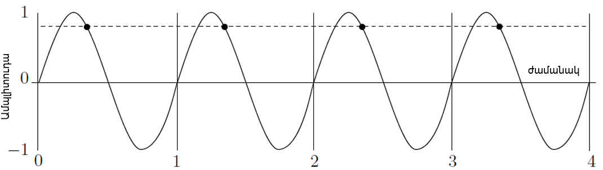

Նկ. 2.2.1 Ձայնային ազդանշան

Նկ․ 2.2.2-ը ցույց է տալիս յոթ նմուշի կետերը, և դրանք բավականին մոտիկից
«հետևում» են սկզբնական ալիքին։ Երբ դրանք օգտագործվում են ձայնը
վերարտադրելու համար, դրանք ստեղծում են կետագծերով ցույց տրված կորը։
Այսինքն պարզապես բավարար նմուշներ չկան սկզբնական ձայնային ալիքը
վերականգնելու համար։

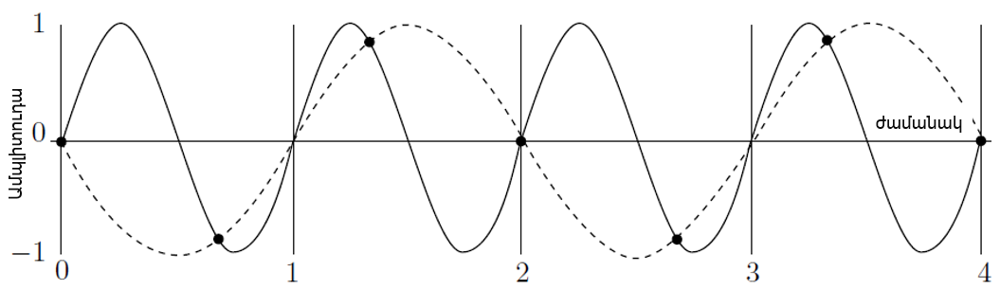

Նկ. 2.2.2 Ոչ բավարար նմուշավորման օրինակ

Խնդրի լուծումը ձայնը Նայքվիստի հաճախականությունից մի փոքր ավելի բարձր
հաճախությամբ նմուշավորումն է, որը ձայնում պարունակվող առավելագույն
հաճախականության կրկնակին է։ Այսպիսով, եթե ձայնը պարունակում է մինչև 2
կՀց հաճախականություններ, այն պետք է նմուշառվի 4 կՀց-ից մի փոքր ավելի
հաճախականությամբ։ Գրականության մեջ հաճախ անտեսվող մանրամասնությունն այն
է, որ ազդանշանի վերակառուցումը կատարյալ է միայն այն դեպքում, եթե
օգտագործվում է Նայքվիստ-Շենոնի նմուշավորման թեորեմը։ Նման նմուշավորման
հաճախականությունը երաշխավորում է ձայնի ճշգրիտ վերարտադրությունը։ Դա
պատկերված է Նկ․ 2.2.3-ում, որը ցույց է տալիս չորս ժամանակահատվածներում
վերցված 10 հավասարաչափ տարածված նմուշներ։ Նմուշները պարտադիր չէ, որ
վերցվեն ալիքի առավելագույն կամ նվազագույն կետերից, դրանք կարող են լինել
ցանկացած կետից։

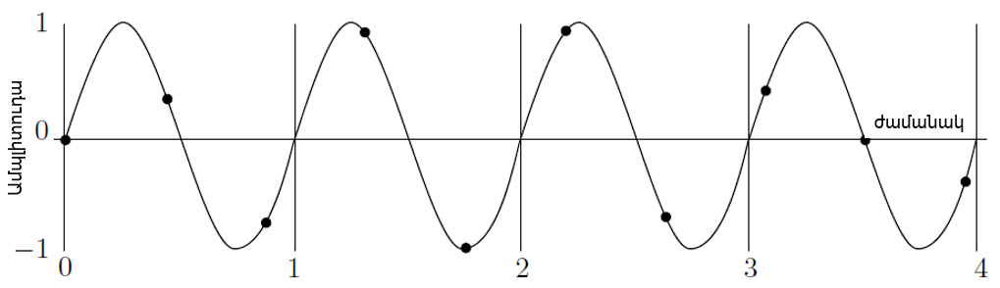

Նկ. 2.2.3 Բավարար նմուշավորման օրինակ

x(t<sub>k</sub>)-ի արժեքների մեծ քանակը ապահովում է վերարտադրման բարձր
ճշտություն, սակայն պահանջում է հիշողության և մշակման մեծ ծավալներ:
Օպտիմալ է կոչվում այն դիսկրետացումը, որը նվազագույն արժեքների քանակի
դեպքում ապահովում է պահանջվող ճշտությունը: Դիսկրետացման քայլի, այսինքն
$`\mathrm{\Delta}`$T-ի ընտրությունը, երբ x(t) ազդանշանի սպեկտրը
սահմանափակ է, հնարավոր է իրականացնել Կոտելնիկով - Նայքվիստի թեորեմի
հիման վրա \[4\]:

Կոտելնիկով - Նայքվիստի թեորեմ․

Եթե x(t) ֆունկցիան բավարարում է Դիրիխլեի պայմաններին, այսինքն՝

1\) սահմանափակ է,

2\) կտոր առ կտոր անընդհատ է,

3\) ունի վերջավոր քանակությամբ էքստրեմումներ,

և նրա սպեկտրը սահմանափակված է $`\omega_{m}`$ հաճախականությամբ, ապա
դիսկրետացման քայլերի միջև գոյություն ունի այնպիսի $`\mathrm{\Delta}`$T
ինտերվալ, որի դեպքում հնարավորություն կա այդ դիսկրետացման քայլերի
միջոցով անսխալ վերականգնել $`x(t)`$ դիսկրետացվող ֆունկցիան: Այդ
առավելագույն ինտերվալը հավասար է՝

``` math
\Delta T = \frac{\pi}{\omega_{m}} = \frac{1}{{2f}_{m}}\ \ \ \ (2.2.1)
```

Ապացույց.\
Թեորեմն ապացուցելու համար դիտարկենք $`X(t)`$ անընդհատ ֆունկցիայի Ֆուրիեի
ուղիղ և հակադարձ ձևափոխությունների արտահայտությունները:

``` math
t \rightarrow a + i\omega,\ ենթադրենք\ a = 0
```

``` math
S(i\omega) = \int_{- \infty}^{\infty}{x(t)e^{- i\omega t}dt\ \ \ \ (2.2.2)}
```

``` math
X(t) = \frac{1}{2\pi}\int_{- \infty}^{\infty}{S(i\omega)e^{i\omega t}d\omega\ \ \ \ (2.2.3)}
```
Քանի որ ըստ թեորեմի պայմանի $`\omega`$-ն պետք է գտնվի
(-$`\omega`$<sub>m</sub> \< $`\omega`$ \< $`\omega`$<sub>m</sub>)
սահմաններում,

հետևաբար\`

$`S(i\omega)' \neq 0,երբ`$ -$`\omega`$<sub>m</sub> \< $`\omega`$ \<
$`\omega`$<sub>m</sub> և
$`S(i\omega) = 0,\ երբ|\omega|\  > \omega_{m\ }\ \ \ \ (2.2.4)`$

ապա $`X(t)`$-ի համար կունենանք՝

``` math
X(t) = \frac{1}{2\pi}\int_{- \omega_{m}}^{\omega_{m}}{S(i\omega)e^{i\omega t}d\omega\ \ \ \ (2.2.5)}
```
Դիտարկենք $`X(t)`$ ֆունկցիայի կոմպլեքս սպեկտրը: Քանի որ այն տրված է
\[-$`\omega_{m}`$, $`\omega_{m}`$\] ինտերվալում, նրան կարելի է վերլուծել
Ֆուրիեի կոմպլեքս շարքի՝

``` math
S(i\omega) = \sum_{k = - \infty}^{\infty}{C_{k}e^{\frac{i\pi k\omega}{\omega_{m\ }}}}\ \ \ \ (2.2.6)
```

որտեղ՝

``` math
C_{k} = \frac{1}{{2\omega}_{m}}\int_{- \omega_{m}}^{\omega_{m}}{S(i\omega)e^{- \frac{i\pi k\omega}{\omega_{m\ }}}d\omega\ \ \ \ (2.2.7)}
```

Համեմատելով $`S(i\omega)`$-ն և C<sub>k</sub>-ն, տեսնում ենք, որ դրանք
համընկնում են հաստատուն բազմապատկիչի ճշտությամբ՝
$`\mathrm{\Delta}T = \frac{\mathrm{\Delta}}{\omega_{m\ }},\`$եթե
ընդունենք, որ $`t = - K\mathrm{\Delta}T`$:

``` math
C_{k} = \frac{\pi}{\omega_{m}}x( - k\mathrm{\Delta}T)\ \ \ \ (2.2.8)
```

Տեղադրելով C<sub>k</sub>-ի արտահայտությունը (2.2.6)–ի մեջ, կստանանք՝

``` math
S(j\omega) = \sum_{k = - \infty}^{\infty}\frac{\pi}{\omega_{m}}x( - k\mathrm{\Delta}T)e^{\frac{i\pi k\omega}{\omega_{m}}}\ \ \ \ \ (2.2.9)
```
Տեղադրենք այս արտահայտությունը (2.2.5)-ի մեջ՝ փոխելով k-ի նշանը (քանի որ
գումարումը իրականացվում է k-ի բոլոր արժեքների համար)։ Բացի այդ, հաշվի
առնելով Ֆուրիեի շարքի և ինտեգրալի զուգամիտությունը, իրականացնենք
գումարման և ինտեգրման գործողությունների տեղափոխում՝

``` math
X(t) = \frac{1}{2\pi}\int_{- \omega_{m}}^{\omega_{m}}{e^{i\omega t}d\omega*}\sum_{k = - \infty}^{\infty}\frac{\pi}{\omega_{m}}x( - k\mathrm{\Delta}T)e^{\frac{i\pi k\omega}{\omega_{m}}} = \frac{1}{{2\omega}_{m}}\sum_{k = - \infty}^{\infty}(k\mathrm{\Delta}T)\int_{- \omega_{m}}^{\omega_{m}}{e^{i\omega(t - K\mathrm{\Delta}T)}d\omega\ \ \ \ \ \ (2.2.10)}
```

``` math
\int_{- \omega_{m}}^{\omega_{m}}{e^{i\omega(t - K\mathrm{\Delta}T)}d\omega} = \frac{1}{j(t - K\mathrm{\Delta}T)}e^{i\omega(t - K\mathrm{\Delta}T)}\int_{- \omega_{m}}^{\omega_{m}} = \frac{{2sin\omega}_{m}(t - K\mathrm{\Delta}T)}{(t - K\mathrm{\Delta}T)}\ \ \ \ (2.2.11)
```
Տեղադրելով կստանանք՝

``` math
X(t) = \sum_{k = - \infty}^{\infty}x( - k\mathrm{\Delta}T)*\frac{{sin\lbrack\omega}_{m}(t - K\mathrm{\Delta}T)\rbrack\ }{{\lbrack\omega}_{m}(t - K\mathrm{\Delta}T)\rbrack}\ \ \ \ \ (2.2.12)
```
2.2.12-ը կոչվում է Կոտելնիկովի շարք:

Այս տեսքի առավելությունը կայանում է նրանում, որ գտնում ենք x-ի
ակնթարթային արժեքը: $`K\mathrm{\Delta}T`$ պահերին ունեցած
$`(K\mathrm{\Delta}T)`$ արժեքների հիման վրա $`x(t)`$ ազդանշանի
վերականգնման համար վերարտադրող ֆունկցիա է ծառայում հետևյալ վերարտադրող
ֆունկցիան, որն ունի որոշակի հատկություններ\`

``` math
y(t) = \ \frac{{\sin\omega}_{m}(t - K\mathrm{\Delta}T)}{\omega_{m}(t - K\mathrm{\Delta}T)}\ \ \ \ \ (2.2.13)
```

Վերարտադրող ֆունկցիայի հատկությունները հետևյալն են\`

> 1\) $`K\mathrm{\Delta}T`$ պահին այն ընդունում է իր առավելագույն
> արժեքը, որը հավասար է 1,
>
> 2\) այն $`I\mathrm{\Delta}T`$ պահերին, երբ$`\ l \neq K`$, $`y(IAT)`$-ն
> ընդունում է 0 արժեք՝ $`y(lAT) = 0`$,
>
> 3\) $`y(t)`$-ն օրթոգոնալ է ժամանակի անսահման մեծ հատվածում:


Նկ․ 2․2․4 Վերարտադրող ֆունկցիան ըստ ժամանակի

Նշված հատկությունների շնորհիվ $`x(t)`$ անընդհատ ազդանշանը հնարավոր է
լինում վերականգնել նրա բաղադրիչ ենթաազդանշանների օգնությամբ:

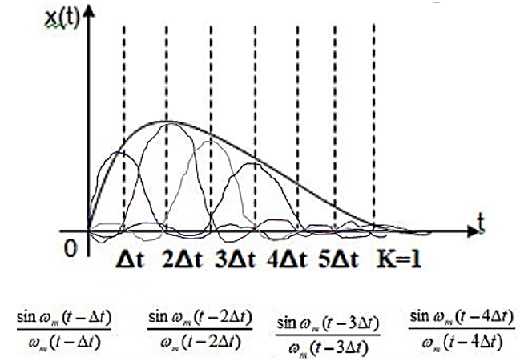

Նկ․ 2․2․5 Անընդհատ ազդանշանը և նրա բաղադրիչները ըստ ժամանակի

$`x(t)`$-ն իրենից կներկայացնի k = $`\overline{1,5}`$ դեպքերի
$`y(t)`$-երի գումար, որը երևում է վերարտադրող ֆունկցիայի
հատկություններից:

## 2․3 Ավանդական սեղմման մեթոդներ

Ավանդական սեղմման վիճակագրական և բառարանային մեթոդները, ինչպիսին է
օրինակ «կատարման երկարության կոդավորում»-ը կամ ԿԵԿ (RLE - Run Length
Encoding), կարող են օգտագործվել ձայնային ֆայլերը առանց կորուստների
սեղմելու համար, սակայն արդյունքները մեծապես կախված են կոնկրետ ձայնից:
Որոշ ձայնի տեսակներ կարող են լավ սեղմվել ԿԵԿ-ի ոչ վիճակագրական մեթոդի
դեպքում: Ձայնի մյուս տեսակները կարող են հարմարվել վիճակագրական սեղմմանը,
բայց կարող են ընդարձակվել, երբ մշակվեն բառարանային մեթոդով: Ահա, թե
ինչպիսի արդյունքներ կարող են լինել սեղմման երեք դասերից յուրաքանչյուրը
կիրառելու դեպքում: ԿԵԿ-ն կարող է լավ աշխատել, երբ ձայնը պարունակում է
նույնական նմուշների երկար շարքեր: 8 բիթային նմուշների դեպքում սա կարող է
տարածված լինել: Հիշենք, որ երկու 8-բիթային $`n`$ և $`n + 1`$ նմուշների
միջև տարբերությունը մոտ 4 մվ է: Միատարր երաժշտության մի քանի վայրկյան,
որտեղ ալիքը չի տատանվում 4 մվ-ից ավելի, կարող է առաջացնել հազարավոր
նույնական նմուշների շարք: 16-բիթային նմուշների դեպքում երկար շարքերը
կարող են հազվադեպ լինել, և, հետևաբար, ԿԵԿ-ը կլինի անարդյունավետ \[6\]:

Վիճակագրական մեթոդները նմուշներին վերագրում են փոփոխական չափի կոդեր՝ ըստ
դրանց հայտնվելու հաճախականության: 8-բիթային նմուշների դեպքում կա
ընդամենը 256 տարբեր նմուշ, ուստի մեծ ձայնային ֆայլում նմուշները երբեմն
կարող են ունենալ հարթ բաշխում: 16-բիթային նմուշների դեպքում կա ավելի քան
65,000 հնարավոր նմուշ, ուստի դրանք երբեմն կարող են ունենալ թեքված
հավանականություններ, այսինքն որոշ նմուշներ կարող են շատ հաճախ հանդիպել,
մինչդեռ մյուսները՝ հազվադեպ: Հետևաբար, նման ֆայլը կարող է ավելի լավ
սեղմվել թվաբանական կոդավորմամբ, որը լավ է աշխատում նույնիսկ թեքված
հավանականությունների դեպքում: Բառարանների վրա հիմնված մեթոդները
ակնկալում են նույն արտահայտությունները կրկին ու կրկին գտնել տվյալներում:
Սա տեղի է ունենում տեքստի հետ, որտեղ որոշակի տողեր կարող են հաճախ
կրկնվել: Հնչյունը, սակայն, անալոգային ազդանշան է, և ստեղծված որոշակի
նմուշները կախված են անալոգաթվային ձևափոխիչի աշխատանքի ճշգրտությունից:
Օրինակ՝ 8-բիթային նմուշներով, 8 մվ ալիքը դառնում է 2 չափի նմուշ, սակայն
դրան շատ մոտ ալիքները, օրինակ՝ 7.6 մվ կամ 8.5 մվ, կարող են դառնալ տարբեր
չափերի նմուշներ։ Ահա թե ինչու խոսքի մասերը, որոնք մեզ համար նույնն են
հնչում և, հետևաբար, պետք է դառնային նույնական արտահայտություններ,
վերջիվերջո թվայնացվում են մի փոքր տարբեր կերպ և բառարանում մուտքագրվում
են որպես տարբեր արտահայտություններ, այդպիսով նվազեցնելով սեղմումը։
Բառարանի վրա հիմնված մեթոդները հարմար չեն ձայնային տվյալների սեղմման
համար։

## 2.4 Ձայնի կորստային սեղմում

Հնարավոր է ավելի լավ ձայնային սեղմում ստանալ՝ մշակելով կորստային
մեթոդներ, որոնք օգտագործում են ձայնի մեր ընկալումը և մերժում այն
​​տվյալները, որոնց նկատմամբ մարդու ականջը զգայուն չէ։ Սա նման է պատկերի
կորստային սեղմմանը, որտեղ դուրս են բերվում այն տվյալները, որոնց նկատմամբ
մարդու աչքը զգայուն չէ։ Երկու դեպքում էլ մենք օգտագործում ենք այն փաստը,
որ սկզբնական տեղեկատվությունը՝ պատկերը կամ ձայնը, անալոգային է և արդեն
կորցրել է որակի որոշ մաս թվայնացման ժամանակ։ Ավելի շատ տվյալների
կորուստը եթե արվի զգուշորեն, կարող է էապես չազդել վերարտադրվող ձայնի վրա
և, հետևաբար, կարող է անզանազանելի լինել սկզբնականից։ Համառոտ նկարագրենք
երկու մոտեցում՝ լռության սեղմում և համադրում \[6\]։

Լռության սեղմման սկզբունքն այն է, որ փոքր նմուշներին վերաբերվել այնպես,
կարծես դրանք լռություն լինեն, այսինքն որպես 0 նմուշներ: Սա առաջացնում է
զրոյական վազքի երկարություններ, ուստի լռության սեղմումը իրականում ԿԵԿ-ի
տարբերակ է, որը հարմար է ձայնի սեղմման համար: Այս մեթոդը օգտագործում է
այն փաստը, որ որոշ մարդիկ ունեն ավելի քիչ զգայուն լսողություն, քան
մյուսները, և կհանդուրժեն այնքան լուռ ձայնի կորուստը, որ նրանք կարող են
չլսել: Երկար ժամանակահատվածներ պարունակող ցածր ծավալի ձայնի ձայնային
ֆայլերը ավելի լավ կարձագանքեն լռության սեղմմանը, քան այլ ֆայլերը, որոնք
ունեն բարձր ծավալի ձայն: Այս մեթոդը պահանջում է օգտագործողի կողմից
կառավարվող պարամետր, որը նշում է ամենամեծ նմուշը, որը պետք է ճնշվի:
Անհրաժեշտ են նաև երկու այլ պարամետրեր, չնայած դրանք պարտադիր չէ, որ
լինեն օգտագործողի կողմից կառավարվող: Մեկը նշում է փոքր նմուշների
ամենակարճ վազքի երկարությունը, սովորաբար 2 կամ 3, մյուսը նշում է
լռության վազքը ավարտող հաջորդական մեծ նմուշների նվազագույն քանակը:
Օրինակ, 15 փոքր նմուշներից բաղկացած շարքը, որին հաջորդում են երկու մեծ
նմուշներ, որին հաջորդում են 13 փոքր նմուշներ, կարող է համարվել 30
նմուշներից բաղկացած մեկ լռության շարք, մինչդեռ 15, 2, 13 շարքը կարող է
դառնալ 15 և 13 նմուշներից բաղկացած երկու առանձին լռության շարքեր, որոնց
միջև ընկած է ոչ լռության պատկեր։

Համադրումը (կրճատն է «սեղմում/ընդլայնում»-ի) օգտագործում է այն փաստը, որ
ականջը պահանջում է ավելի ճշգրիտ նմուշներ ցածր ամպլիտուդաներում (մեղմ
ձայներ), բայց ավելի ներողամիտ է բարձր ամպլիտուդաներում: Անձնական
համակարգիչների ձայնային քարտերում օգտագործվող տիպիկ անալոգաթվային
ձևափոխիչը լարումները գծային կերպով փոխակերպում է թվային տվյալների կամ
թվերի: Եթե $`a`$ ամպլիտուդան փոխակերպվում է $`n`$ թվի, ապա $`2a`$
ամպլիտուդան կփոխակերպվի $`2n`$ թվի: Համադրում օգտագործող սեղմման մեթոդը
ուսումնասիրում է ձայնային ֆայլի յուրաքանչյուր նմուշ և օգտագործում է ոչ
գծային բանաձև՝ դրան հատկացված բիթերի քանակը նվազեցնելու համար: Օրինակ՝
16-բիթային նմուշների համար համադրման կոդավորիչը կարող է օգտագործել
հետևյալ բանաձևը յուրաքանչյուր նմուշը նվազեցնելու համար․

$`Կապ = 32,767{(2}^{\frac{Նմուշ}{65536}} - 1)`$ (2.4․1)

Այս բանաձևը 16-բիթային նմուշները ոչ գծային կերպով կապում է 15-բիթային
թվերի հետ, այսինքն՝ \[0, 32767\] միջակայքում գտնվող թվերի, որպեսզի փոքր
նմուշները ավելի քիչ ազդվեն, քան մեծերը:

Ստացված 15-բիթային թվերը կարող են վերծանվել սկզբնական 16-բիթային
նմուշների հակադարձ բանաձևով․

$`Նմուշ = 65,536\log_{2}{(1 + \ \frac{Կապ}{32,767}\ })`$ (2.4․2)

16-բիթային թվերը 15 բիթ դարձնելը մեծ սեղմում չի առաջացնում: Ավելի լավ
սեղմում կարելի է ստանալ 2.4.1 և 2.4.2 հավասարումներում 32,767-ը
փոխարինելով ավելի փոքր թվով: Օրինակ՝ 127 արժեքը յուրաքանչյուր 16-բիթային
նմուշը կփոխանցի 8-բիթային նմուշի, որի արդյունքում կստացվի 0.5 սեղմման
հարաբերակցություն: Այնուամենայնիվ, վերծանումը պակաս ճշգրիտ կլինի:
Օրինակ՝ 60,100 16-բիթային նմուշը կփոխանցվի 8-բիթային 113 թվին, բայց
1.7.2 հավասարմամբ վերծանելիս այս թիվը կստացվի 60,172: Ավելի վատն այն է,
որ փոքր 16-բիթային նմուշը՝ 1000-ը, կփոխանցվի 1.35-ին, որը պետք է
կլորացվի մինչև 1:

Երբ 2.4.2 հավասարումն օգտագործվում է 1-ը վերծանելու համար, այն ստանում է
742, որը զգալիորեն տարբերվում է սկզբնական նմուշից: Հետևաբար, սեղմման
չափը պետք է լինի օգտագործողի կողմից կառավարվող պարամետր, և սա սեղմման
մեթոդի հետաքրքիր օրինակ է, որտեղ սեղմման հարաբերակցությունը նախապես
հայտնի է։ Գործնականում անհրաժեշտ չէ անցնել 2.4.1 և 2.4.2
հավասարումներով, քանի որ բոլոր նմուշների մուտքագրումը կարող է նախապես
պատրաստվել աղյուսակում։ Հետևաբար, և՛ կոդավորումը, և՛վերծանումը արագ են։
Համեմատությունը չի սահմանափակվում 2.4.1 և 2.4.2 հավասարումներով։ Ավելի
բարդ մեթոդներ, ինչպիսիք են μ-օրենքը և A-օրենքը, լայնորեն օգտագործվում են
և նշանակվել են որպես միջազգային ստանդարտներ։

## 2.5 «Ալիք» ձայնային ձևաչափ

«Ալիք»-ը (WAVE կամ պարզապես Wave) Windows օպերացիոն համակարգի կողմից
օգտագործվող բնօրինակ ֆայլի ձևաչափ է թվային ձայնային տվյալները պահպանելու
համար: Բոլոր ժամանակակից օպերացիոն համակարգերը աջակցում են ձայնային
ֆայլերի բնօրինակ ձևաչափին \[7\]: Նշենք երեք տեխնիկական կետեր․

1\) Wave ֆայլի ձևաչափը բնօրինակ է Windows-ի համար և հետևաբար աշխատում է
Intel պրոցեսորների վրա:

2\) Wave ֆայլերը սովորաբար պարունակում են տեքստային տողեր՝ ազդանշանային
կետեր, պիտակներ, նշումներ և այլ տեղեկատվություն նշելու համար: Տողերը,
որոնց չափը նախապես հայտնի չէ, պահվում են այսպես կոչված Pascal ձևաչափով,
որտեղ առաջին բայթը նշում է տողում ASCII տեքստային բայթերի քանակը:

3\) WAV (կամ .WAV) ֆայլի ձևաչափը Wave-ի հատուկ դեպք է, որտեղ սեղմում չի
օգտագործվում:

Wave ֆայլի կազմակերպումը հիմնված է ստանդարտ «Ռեսուրսների փոխանակման
ֆայլի ձևաչափ»-ի կամ RIFF (Resource Interchange File Format) կառուցվածքի
վրա: Սա մի քանի կարևոր ֆայլերի ձևաչափերի հիմքն է: Ֆայլը բաղկացած է
բաժիններից, որտեղ յուրաքանչյուր բաժին սկսվում է վերնագրով և կարող է
պարունակել ենթաբաժիններ, ինչպես նաև տվյալներ: Օրինակ, fmt և տվյալների
կտորները իրականում RIFF բաժնի ենթաբաժիններ են: Ապագայում կարող են
ավելացվել բաժինների նոր տեսակներ, ինչը կհանգեցնի իրավիճակի, երբ առկա
ծրագրակազմը չի ճանաչի նոր բաժինները: Այսպիսով, ընդհանուր կանոնն է․ բաց
թողնել ցանկացած անճանաչելի բաժինները: Բաժնի ընդհանուր չափը պետք է լինի
զույգ բայթերի քանակ (երկու բայթերի բազմապատիկ), այդ իսկ պատճառով բաժինը
կարող է ավարտվել մեկ բայթով զրոյական լրացմամբ: Wave ֆայլի առաջին մասը
RIFF-ն է։ Այն սկսվում է 4 բայթանոց RIFF տողով, որին հաջորդում է ֆայլի
մնացած մասի չափը (չորս բայթով), որին հաջորդում է WAVE տողը։ Դրան
անմիջապես հաջորդում են ձևաչափի և տվյալների ենթաբաժինները։ Ձևաչափի
ենթաբաժնի օրինակ ներկայացված է Նկ. 2.5.1-ում։

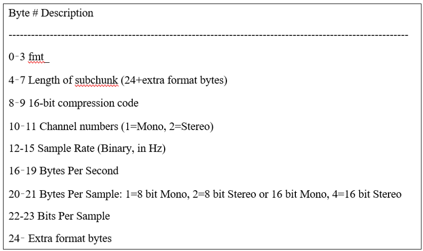

Նկ․ 2.5.1 Wave ֆայլի ձևաչափի ենթաբաժնի օրինակ

Ձևաչափի հատվածում ներառված հիմնական տեխնիկական բնութագրերը հետևյալն են.

1\) Սեղմման կոդ. Wave ֆայլերը կարող են սեղմված լինել: Հատուկ դեպք են
.WAV ֆայլերը, որոնք չեն սեղմվում: Սեղմման կոդերի օրինակներ ներկայացված
են Նկ․ 2.5.2-ում:

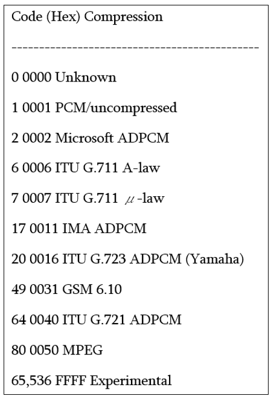

Նկ․ 2.5.2 Wave ֆայլի սեղմման կոդի օրինակ

2\) Ալիքների քանակը. տվյալների բաժնում կոդավորված ձայնային ալիքների
քանակը: 1 արժեքը ցույց է տալիս մոնո ազդանշան, 2-ը՝ ստերեո և այլն:

3\) Նմուշավորման հաճախականությունը. ցույց է տալիս ձայնային նմուշների
քանակը մեկ վայրկյանում: Այս արժեքը կախված չէ ալիքների քանակից:

4\) Վայրկյանում բայթերի միջին քանակը. քանի՞ բայթ ալիքային տվյալներ պետք
է ուղարկվեն թվաանալոգային ձևափոխիչին վայրկյանում, որպեսզի ալիքային ֆայլը
վերարտադրվի: Այս արժեքը նմուշավորման հաճախականության և բլոկի
հավասարեցման արտադրյալն է:

5\) Բլոկների հավասարեցում. նմուշի մեկ հատվածի բայթերի քանակը: Այս արժեքը
չի փոփոխվում ալիքների քանակից կախված:

6\) Նշանակալի բիթեր մեկ նմուշի համար. ձայնային նմուշի բիթերի քանակը,
առավել հաճախ՝ 8, 16, 24 կամ 32: Եթե բիթերի քանակը 8-ի բազմապատիկ չէ, ապա
նմուշի համար օգտագործված բայթերի քանակը կլորացվում է մինչև մոտակա բայթի
չափը, իսկ չօգտագործված բայթերը սահմանվում են 0 և անտեսվում:

7\) Լրացուցիչ ձևաչափի բայթեր. հաջորդող լրացուցիչ ձևաչափի բայթերի քանակը:
Այս բայթերը օգտագործվում են ոչ զրոյական սեղմման կոդերի համար: Դրանց
նշանակությունը կախված է օգտագործված կոնկրետ սեղմումից: Եթե այս արժեքը
զույգ չէ այսինքն 2-ի բազմապատիկ, այս տվյալների վերջում պետք է ավելացվի
զրոյական լրացման մեկ բայթ՝ այն հավասարեցնելու համար, բայց արժեքն ինքնին
պետք է մնա կենտ:

Տվյալների հատվածը սկսվում է տողային տվյալներից, որին հաջորդում է
հաջորդող տվյալների չափը որպես 32-բիթային ամբողջ թիվ: Դրան հաջորդում են
տվյալների բայթերը՝ ձայնային նմուշները: Նկ․ 2.5.3-ում ներկայացված են պարզ
.WAV ֆայլի առաջին 80 բայթերը \[1\]:

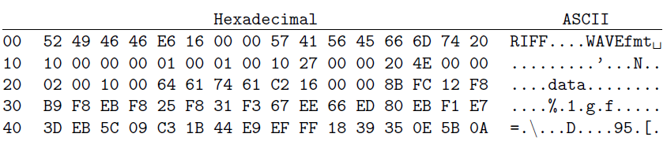

Նկ․ 2.5.3 ․WAV ֆայլի օրինակ

Ֆայլը սկսվում է RIFF նույնականացնող տողից։ Հաջորդ չորս բայթերը
երկարությունն են, որը կազմում է 16e616 = 5,86210 բայթ։ Այս թիվը ամբողջ
ֆայլի երկարությունն է՝ հանած RIFF-ի և երկարության 8 բայթերը։ Հաջորդում
են WAVE և fmt տողերը։ Երկրորդ տողը սկսվում է ձևաչափի կտորի 1016 = 2410
երկարությամբ։ Սա ցույց է տալիս, որ լրացուցիչ բայթեր չկան։ Հաջորդ երկու
բայթերը 1 են (չսեղմվածի սեղմման կոդ), որին հաջորդում են ևս երկու բայթ
1-ով՝ մոնո ձայն և միայն մեկ ալիք։ Ձայնային նմուշավորման արագությունը
2,71016 = 10,00010 է, իսկ վայրկյանում բայթերը՝ 4e2016 = 20,00010։ Երրորդ
տողը սկսվում է նմուշի համար բայթերով՝ 2-ի երկու բայթ, որը ցույց է տալիս
8-բիթ ստերեո կամ 16-բիթ մոնո։ Հաջորդ երկու բայթերը նմուշի բիթերն են (մեր
դեպքում՝ 16): Այժմ մենք գիտենք, որ այս ձայնը մոնո է՝ 16-բիթանոց ձայնային
նմուշներով: Տվյալների ենթաբաժինը անմիջապես հաջորդում է: Այն սկսվում է
տողային տվյալներով, որին հաջորդում են չորս բայթերը՝ 16c216, որոնք ցույց
են տալիս, որ հաջորդում են 582610 բայթ ձայնային տվյալներ: Առաջին չորս
նման բայթերը (երկու ձայնային նմուշներ) 8B FC 12 F8 են:

WAV ֆայլի ընդհանուր նկարագրությունը հետևյալն է․

\<WAVE-form\> → RIFF('WAVE'

\<fmt-ck\> // Format of the file

\[\<fact-ck\>\] // Fact chunk

\[\<cue-ck\>\] // Cue points

\[\<playlist-ck\>\] // Playlist

\[\<assoc-data-list\>\] // Associated data list

\<wave-data\> ) // Wave data

Չնայած WAV ֆայլը կարող է պարունակել սեղմված ձայնային տվյալներ,
ամենատարածված WAV ձևաչափը չսեղմված ձայնային տվյալներն են գծային
իմպուլսային կոդային մոդուլյացիայի (LPCM-Linear Pulse-Code Modulation)
ձևաչափով: LPCM-ը նաև CD-ների ստանդարտ կոդավորման ձևաչափն է, որը
պահպանում է երկալիք LPCM ձայնային նմուշավորում 44.1 կՀց
հաճախականությամբ՝ յուրաքանչյուր նմուշի համար 16 բիթով: Քանի որ LPCM-ը
չսեղմված է և պահպանում է ձայնի բոլոր նմուշները, պրոֆեսիոնալ
օգտագործողները կամ փորձագետները կարող են օգտագործել WAV ձևաչափը LPCM-ի
հետ՝ ձայնի առավելագույն որակի համար: WAV ֆայլերը նույնպես կարող են
խմբագրվել համեմատաբար հեշտությամբ՝ օգտագործելով ծրագրային ապահովում: WAV
ֆայլերը օգտագործվում են պրոֆեսիոնալ ձայնագրման և խմբագրման համար՝ իրենց
չսեղմված, բարձրորակ բնույթի շնորհիվ, ինչը դրանք հարմար է դարձնում
այնպիսի կիրառությունների համար, ինչպիսիք են նոր երաժշտության ​​ստեղծումը,
ձայնի խմբագրումը և ռադիոհեռարձակումը: Դրանք նաև օգտագործվում են որպես
ընդհանուր ձևաչափ Windows-ում և macOS-ում ձայնային նվագարկման համար,
հաճախ լռելյայնորեն՝ Windows Media Player-ի, iTunes-ի կամ QuickTime-ի
նման ծրագրերի հետ։ Առանձնանում են հետևյալ կիրառությունները․

1\) Ձայնագրում և խմբագրում. WAV ֆայլերը ստանդարտ են ձայնային
աշխատանքային կայանների համար, քանի որ դրանք ապահովում են բնօրինակ ձայնի
կատարյալ պատճենը՝ առանց տվյալների կորստի։

2\) Հետարտադրություն. Դրանք օգտագործվում են ֆիլմերում և
հեռուստատեսությունում ձայնի խմբագրման և միքսելու համար։

3\) Մետատվյալների խմբագրում. Wave Agent-ի նման հավելվածները թույլ են
տալիս մասնագետներին ավելացնել և խմբագրել որոշակի մետատվյալներ, ինչպիսիք
են տեսարանների, կադրերի և երգերի անունները, ինչը կարևոր է խոշոր
նախագծերի կառավարման համար։

4\) Հեռարձակում. Շատ ռադիոկայաններ օգտագործում են WAV ֆայլեր իրենց
ժապավենազուրկ համակարգերի համար՝ բարձր որակի և ճշգրտության շնորհիվ։

5\) Ծրագրային ապահովում և խաղերի մշակում. WAV ֆայլերը օգտագործվում են
ծրագրային ապահովման և խաղերի մշակման մեջ՝ ձայնային էֆեկտների,
երաժշտության և ձայնագրությունների համար:

WAV ֆայլի ձևաչափի օգտագործման բազմաթիվ առավելություններ կան, ինչը այն
դարձնում է հարմար ընտրություն որոշակի կիրառությունների համար.

1\) WAV ֆայլերը պահպանում են բնօրինակ ձայնային տվյալները, քանի որ դրանք
չեն սեղմվում և չեն կորցնում իրենց որակը։

2\) Դրանք կարող են օգտագործվել բազմաթիվ հարթակներում։

3\) Դրանք հեշտությամբ խմբագրելի են ձայնային խմբագրման ծրագրաշարի
միջոցով։

Չսեղմված WAV ֆայլերը մեծ են, ուստի WAV ֆայլերի ինտերնետով փոխանակումը
հազվադեպ է, բացառությամբ տեսանյութերի և երաժշտության մասնագետների
շրջանում: Ձևաչափը հարմար է առաջին սերնդի բարձր որակի արխիվացված ֆայլերը
պահպանելու համար և այն համակարգերում օգտագործելու համար, որտեղ
հիշողության սկավառակի տարածքը և ցանցային թողունակությունը
սահմանափակումներ չեն:

# ԽՆԴՐԻ ԴՐՎԱԾՔԸ

Խնդրի դրվածքն է ձայնային ազդանշանի սեղմման ալգորիթմների խորացված
ուսումնասիրություն և դրանց հիման վրա օպտիմալ սեղմման ալգորիթմի մշակում և
իրականացում։

Իրագործելու համար կատարվելու է քայլերի հետևյալ հաջորդականությունը․

- Կոդավորման դասական ալգորիթմների ուսումնասիրություն,

- Ձայնային ազդանշանի թվային ներկայացման մեթոդների վերլուծություն,

- Դասական ալգորիթմների կիրառմամբ օպտիմալ ալգորիթմի մշակում,

- Ալգորիթմի իրականացում ծրագրային ապարատի միջոցով,

- Վերը նշված քայլերի արդյունքում ձևավորված տեղեկատվության համեմատական
  հետազոտություն։

ԳԼՈՒԽ 3*\*
Սեղմման կարևորագույն ալգորիթմներ և դրանց կիրառությունները
=========================================================

## 3.1 Zstd սեղմման ալգորիթմ

Zstandard-ը, կամ կարճ՝ Zstd, արագ և կորստից զուրկ սեղմման ալգորիթմ է։
Այն նախատեսված է իրական ժամանակում տվյալների zlib մակարդակում
(zlib-level) սեղղման համար՝ ապահովելով բարձր սեղմման
հարաբերակցություններ: Ալգորիթմը ապահովված է շատ արագ էնտրոպիայի փուլով:
Այն մշակվել է Facebook-ում Յան Քոլեթի կողմից: Zstd-ն թողարկվել է որպես
բաց կոդով ծրագիր 2016 թվականի օգոստոսին: Ալգորիթմը հրապարակվել է 2018
թվականին որպես RFC 8478, որը նաև սահմանում է համապատասխան մեդիա տեսակը՝
«application/zstd», ֆայլի անվան ընդլայնում՝ «zst» և HTTP բովանդակության
կոդավորում՝ «zstd»: Որպես այդպիսին Zstd-ն կարող է իենից ներկայացնել, բաց
կոդով կրկնակի BSD կամ GPLv2 լիցենզավորված C գրադարան, կամ հրամանի տողի
գործիք, որը ստեղծում և վերծանում է .zst, .gz, .xz և .lz4 ֆայլերը: Սկսած
1.3.2 տարբերակից (հոկտեմբեր 2017), Zstd-ն ըստ ցանկության իրականացնում է
շատ երկար հեռավորության որոնում և կրկնօրինակումից ազատում (--long)՝ նման
rzip-ին կամ lrzip-ին։ 2020 թվականի հունիսի 15-ին Zstandard-ը ներդրվեց
zip ֆայլի ձևաչափի 6.3.8 տարբերակում՝ 93 կոդեկի համարով, որը հնեցրեց
նախորդ 20 կոդեկի համարը, ինչպես այն ներդրվել էր հունիսի 1-ին թողարկված
6.3.7 տարբերակում։ 2024 թվականի մարտին Google Chrome-ի 123-րդ տարբերակը
(և Chromium-ի վրա հիմնված որոնման համակարգերը, ինչպիսիք են Brave-ը կամ
Microsoft Edge-ը) HTTP Content-Encoding վերնագրում ավելացրին Zstd
աջակցություն։ 2024 թվականի մայիսին Firefox-ի 126.0 թողարկումը ավելացրեց
Zstd աջակցություն HTTP Content-Encoding վերնագրում \[2\]։

Zstd-ն կարող է նաև առաջարկել ավելի ուժեղ սեղմման հարաբերակցություններ՝
սեղմման արագության հաշվին։ Արագության և սեղմման փոխզիջումը կարգավորվում
է փոքր քայլերով։ Հետսեղմման արագությունը պահպանվում է և մնում է
մոտավորապես նույնը բոլոր կարգավորումներում, մի հատկություն, որը բնորոշ է
LZ սեղմման ալգորիթմների մեծ մասին, ինչպիսիք են zlib-ը կամ lzma-ն։ Որոշ
այլ ալգորիթմներ կարող են ապահովել ավելի բարձր սեղմման հարաբերակցություն՝
ավելի դանդաղ արագություններով։

Zstandard-ը համատեղում է բառարանային համապատասխանեցման փուլը (LZ77) մեծ
որոնման պատուհանի և արագ էնտրոպիայի կոդավորման փուլի հետ։ Այն
օգտագործում է և՛ Հոֆֆմանի, և՛ վերջավոր վիճակի էնտրոպիան (FSE) կամ ANS-ի
արագ աղյուսակավորված տարբերակը՝ tANS-ը, որն օգտագործվում է Sequences
բաժնի գրառումների համար։ FSE-ի կողմից վիճակը սիմվոլների միջև փոխանցելու
եղանակի պատճառով, հետսեղմումը ենթադրում է յուրաքանչյուր բլոկի Sequences
բաժնի սիմվոլների մշակումը հակառակ հերթականությամբ (վերջինից առաջինը) ։

Սեղմման արագությունը կարող է տարբերվել 20 կամ ավելի անգամ ամենաարագ և
ամենադանդաղ մակարդակների միջև, մինչդեռ հետսեղմումը միատարր արագ է՝
տատանվելով 20%-ից պակաս ամենաարագ և ամենադանդաղ մակարդակների միջև։
Zstandard հրամանային տողն ունի «ադապտիվ» (--adapt) ռեժիմ, որը փոխում է
սեղմման մակարդակը՝ կախված մուտքի/ելքի պայմաններից, հիմնականում այն
​​​​արագությունից, թե որքան արագ կարող է այն գրել արդյունքը։ Zstd-ն իր
առավելագույն սեղմման մակարդակում տալիս է lzma-ին, lzham-ին և ppmx-ին մոտ
սեղմման հարաբերակցություն և ավելի լավ է աշխատում քան lza-ն կամ bzip2-ը։
Zstandard-ը հասնում է ներկայիս Պարետոյի սահմանին, քանի որ այն ավելի արագ
է հետսեղմման ենթարկվում, քան ներկայումս առկա ցանկացած այլ ալգորիթմ՝
նմանատիպ կամ ավելի լավ սեղմման հարաբերակցությամբ։

Բառարանները կարող են մեծ ազդեցություն ունենալ փոքր ֆայլերի սեղմման
հարաբերակցության վրա, ուստի Zstandard-ը կարող է օգտագործել օգտատիրոջ
կողմից տրամադրված սեղմման բառարան: Այն նաև առաջարկում է ուսուցման ռեժիմ,
որը կարող է բառարան ստեղծել նմուշների հավաքածուից: Մասնավորապես, մեկ
բառարան կարող է բեռնվել ֆայլերի մեծ հավաքածուներ մշակելու համար՝ ֆայլերի
միջև ավելորդությամբ, բայց ոչ պարտադիր յուրաքանչյուր ֆայլի ներսում,
օրինակ՝ գրանցամատյանների (log) ֆայլերի համար: «Արագ»-ի դեպքում (--fast)
նշված բացասական սեղմման մակարդակները ապահովում են ավելի արագ սեղմման և
հետսեղմման արագություն՝ սեղմման հարաբերակցության հաշվին։

Դիտարկենք մի քանի գրաֆիկական օրինակ տարբեր հարաբերակցությունների համար,
որոնք ցույց են տալիս Zstd-ի ալգորիթմի և այլ ալգորիթմների
համեմատությունը։

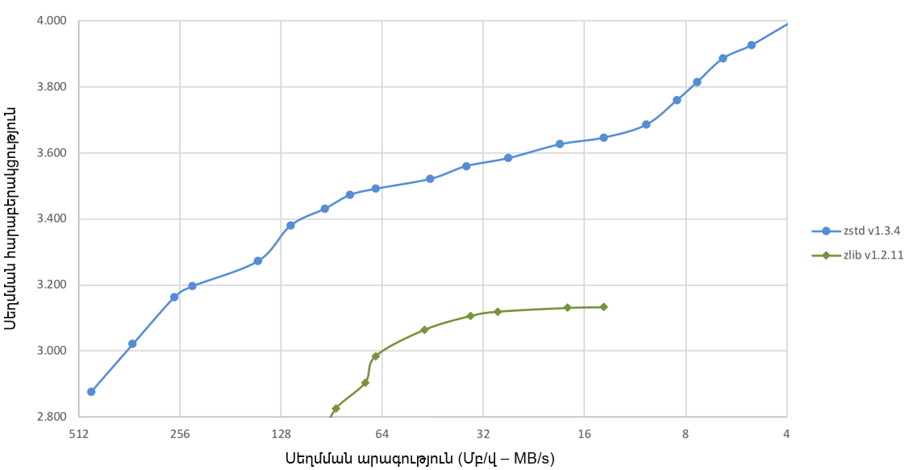

Նկ․ 3.1.1 Սեղմման արագության և հարաբերակցության կապի օրինակ

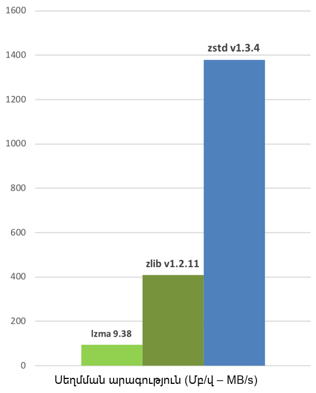

Նկ․ 3.1.2 Սեղմման արագության տարբեր ալգորիթմների համար

Այժմ դիտարկենք քիչ տվյալնների սեմման դեպքը։

Նախորդ բնութագծերը տալիս են արդյունքներ, որոնք կիրառելի են ֆայլերի և
հոսքի տիպիկ սցենարների համար (մի քանի ՄԲ): Որքան փոքր է սեղմվող
տվյալների քանակը, այնքան ավելի դժվար է սեղմել այն: Այս խնդիրը բնորոշ է
բոլոր սեղմման ալգորիթմներին, և պատճառն այն է, որ սեղմման ալգորիթմները
սովորում են անցյալ տվյալներից, թե ինչպես սեղմել ապագա տվյալները: Սակայն
նոր տվյալների հավաքածուի սկզբում չկա «անցյալ», որի վրա կարելի է
կառուցել:

Այս իրավիճակը լուծելու համար Zstd-ն առաջարկում է մարզման ռեժիմ (training
mode), որը կարող է օգտագործվել ալգորիթմը ընտրված տվյալների տեսակի համար
կարգավորելու համար: Zstandard-ի մարզումը իրականացվում է նրան մի քանի
նմուշներ տրամադրելով (մեկ ֆայլ յուրաքանչյուր նմուշի համար): Այս մարզման
արդյունքը պահվում է «բառարան» անունով ֆայլում, որը պետք է բեռնվի
սեղմումից և հետսեղմումից առաջ: Այս բառարանի միջոցով փոքր տվյալների վրա
հասանելի սեղմման հարաբերակցությունը զգալիորեն բարելավվում է:

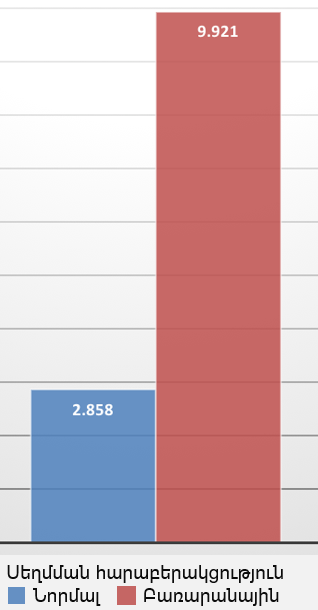

Նկ․ 3.1.3 Սեղմման հարաբերակցությունը նորմալ և բառարանայինի դեպքում

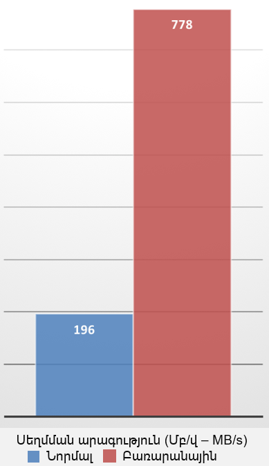

Նկ․ 3.1.4 Սեղմման արագությունը նորմալ և բառարանայինի դեպքում

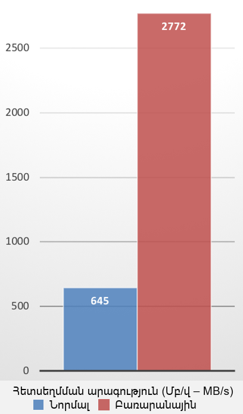

Նկ․ 3.1.5 Հետսեղմման արագությունը նորմալ և բառարանայինի դեպքում

Այս սեղմման աճը ձեռք է բերվում միաժամանակ ավելի արագ սեղմման և
հետսեղմման արագություններ ապահովելով։ Մարզումը գործում է, եթե փոքր
տվյալների նմուշների ընտանիքում կա որոշակի կապ։ Որքան ավելի շատ տվյալների
է հատուկ բառարանը, այնքան ավելի արդյունավետ է այն (համընդհանուր բառարան
չկա)։ Հետևաբար, տվյալների յուրաքանչյուր տեսակի համար մեկ բառարան
տեղակայելը կապահովի ամենամեծ առավելությունները։ Բառարանի աճը հիմնականում
արդյունավետ է առաջին մի քանի KB-ների ընթացքում։ Այնուհետև սեղմման
ալգորիթմը աստիճանաբար կօգտագործի նախկինում վերծանված բովանդակությունը՝
ֆայլի մնացած մասը ավելի լավ սեղմելու համար \[3\]։

Համապատասխան հետսեղմում իրականացնող հանգույցը պետք է կարողանա հետսեղմման
ենթարկել առնվազն մեկ աշխատանքային պարամետրերի հավաքածու, որը
համապատասխանում է այստեղ ներկայացված խնդիրներին։ Այն կարող է նաև անտեսել
տեղեկատվական դաշտերը, ինչպիսիք են ստուգիչ գումարը։ Երբ այն չի աջակցում
սեղմված հոսքում սահմանված պարամետրին, այն պետք է ստեղծի ոչ երկիմաստ
սխալի կոդ և դրան կից սխալի հաղորդագրություն, որը բացատրում է, թե որ
պարամետրը չի աջակցվում։ Այս խնդրի դրվածքը նախատեսված է ծրագրային
ապահովման ներդրողների կողմից օգտագործելու համար՝ տվյալները Zstandard
ձևաչափի մեջ սեղմելու, և/կամ տվյալները Zstandard ձևաչափից հետսեղմման
ենթարկելու համար։ Zstandard ձևաչափը աջակցվում է բաց կոդով հղման
իրականացման կողմից, որը գրված է փոխադրելի C լեզվով և հասանելի է ZSTD-ի
կայքում։

Zstandard սեղմված տվյալները կազմված են մեկ կամ մի քանի շրջանակներից
(frame)։ Յուրաքանչյուր շրջանակ անկախ է և կարող է հետսեղմվել մյուս
շրջանակներից անկախ։ Մի քանի միացված շրջանակների հետսեղմման
բովանդակությունը յուրաքանչյուր շրջանակի հետսեղմված բովանդակության
միացումն է։ Zstandard-ի համար սահմանված են երկու շրջանակի ձևաչափեր՝
Zstandard շրջանակներ և բաց թողնվող շրջանակներ։ Zstandard շրջանակները
պարունակում են սեղմված տվյալներ, մինչդեռ բաց թողնվող շրջանակները
պարունակում են օգտագործողի կողմից սահմանված մետատվյալներ։

Մեկ Zstandard շրջանակի կառուցվածքը ներկայացված է Աղյուսակ 3.1․1-ում.

<table style="width:74%;">
<colgroup>
<col style="width: 45%" />
<col style="width: 28%" />
</colgroup>
<thead>
<tr>
<th style="text-align: center;"><p>Կախարդական համար</p>
<p>(Magic Number)</p></th>
<th style="text-align: center;"><p>4 Բայթ</p>
<p>(bytes)</p></th>
</tr>
</thead>
<tbody>
<tr>
<td style="text-align: center;"><p>Շրջանակի վերնագիր</p>
<p>(Frame Header)</p></td>
<td style="text-align: center;"><p>2 – 14 Բայթ</p>
<p>(bytes)</p></td>
</tr>
<tr>
<td style="text-align: center;"><p>Տվյալների բաժին</p>
<p>(Data Block)</p></td>
<td style="text-align: center;"><p>n Բայթ</p>
<p>(bytes)</p></td>
</tr>
<tr>
<td style="text-align: center;"><p>Ավելի շատ տվյալների բաժիններ</p>
<p>(More Data Block)</p></td>
<td style="text-align: center;"></td>
</tr>
<tr>
<td style="text-align: center;"><p>Բովանդակության ստուգիչ համար</p>
<p>(Content Checksum)</p></td>
<td style="text-align: center;"><p>0 – 4 Բայթ</p>
<p>(bytes)</p></td>
</tr>
</tbody>
</table>

**Աղյուսակ 3․1․1**

**Աղյուսակ 3․1․2**

<table style="width:76%;">
<colgroup>
<col style="width: 49%" />
<col style="width: 26%" />
</colgroup>
<thead>
<tr>
<th style="text-align: center;"><p>Շրջանակի վերնագրի նկարագրություն</p>
<p>(Frame Header Descriptor)</p></th>
<th style="text-align: center;"><p>1 Բայթ</p>
<p>(bytes)</p></th>
</tr>
</thead>
<tbody>
<tr>
<td style="text-align: center;"><p>Պատուհանի նկարագրություն</p>
<p>(Window Descriptor)</p></td>
<td style="text-align: center;"><p>0 – 1 Բայթ</p>
<p>(bytes)</p></td>
</tr>
<tr>
<td style="text-align: center;"><p>Բառարանի նույնականացման համար</p>
<p>(Dictionary ID)</p></td>
<td style="text-align: center;"><blockquote>
<p>0 - 4 Բայթ</p>
</blockquote>
<p>(bytes)</p></td>
</tr>
<tr>
<td style="text-align: center;"><p>Շրջանակի պարունակության չափ</p>
<p>(Frame Content Size)</p></td>
<td style="text-align: center;"><p>0 – 8 Բայթ</p>
<p>(bytes)</p></td>
</tr>
</tbody>
</table>

Կարճ ներկայացնենք թե յուրաքանչյուրն ինչ է ցույց տալիս․

1\) Շրջանակի վերնագրի նկարագրություն. առաջին բայթն է և նկարագրում է, թե
որ մյուս դաշտերն են առկա: Այս բայթի վերծանումը բավարար է Շրջանակի
վերնագրի չափը որոշելու համար:

2\) Պատուհանի նկարագրություն. սա երաշխիքներ է տալիս շրջանակը հետսեղմելու
համար անհրաժեշտ նվազագույն հիշողության բուֆերի վերաբերյալ։ Այս
տեղեկատվությունը կարևոր է ապակոդավորիչների համար՝ բավարար հիշողություն
հատկացնելու համար։ Պատուհանի նկարագրության բայթը ընտրովի է։ Երբ միակ
հատվածի դրոշակը (Single Segment Flag) սահմանված է, ապա պատուհանի
նկարագրությունը բացակայում է։

3\) Բառարանի նույնականացման համար. սա փոփոխական չափի դաշտ է, որը
պարունակում է շրջանակը ճիշտ վերծանելու համար անհրաժեշտ բառարանի
նույնականացման համարը։ Այս դաշտը ընտրովի է։ Երբ այն բացակայում է,
վերծանողի գործն է իմանալ, թե որ բառարանն օգտագործել։ Մեկ բայթը կարող է
ներկայացնել 0-255 ID-ն, 2 բայթը կարող է ներկայացնել 0-65535 ID-ն, 4
բայթը կարող է ներկայացնել 0-4294967295 ID-ն։ Թույլատրվում է ներկայացնել
փոքր ID-ն (օրինակ՝ 13) մեծ 4 բայթանոց բառարանի ID-ով, նույնիսկ եթե դա
պակաս արդյունավետ է։ Մասնավոր միջավայրերում կարող է օգտագործվել ցանկացած
բառարանի ID։ Այնուամենայնիվ, հանրային տարածքում տարածված շրջանակների և
բառարանների համար, նույնականացման համարը պետք է ուշադիր վերագրվի։
Նույնականացման համարի ցանկացած այլ արժեք կարող է օգտագործվել
մասնակիցների միջև անձնական պայմանավորվածությամբ։ Հետսեղմման համար
ներկայացված ցանկացած օգտակար բեռնվածություն, որը հղում է կատարում
չգրանցված ամրագրված բառարանի ID-ի, հանգեցնում է սխալի։

4\) Շրջանակի պարունակության չափ. սա սկզբնական (չսեղմված) չափսն է։ Այս
տեղեկատվությունը ընտրովի է և կարող է հավասար լինել 0 (չկա), 1, 2, 4 կամ
8 բայթի։

Այսպիսով, Zstd-ն իր գերազանց կատարողականության շնորհիվ ավելի ու ավելի
տարածված ընտրություն է դառնում տվյալների սեղմման համար։ Այն աջակցում է
սեղմման լայն շրջանակի մակարդակների, թույլ տալով օգտատերերին ընտրել
սեղմման արագության և հարաբերակցության միջև օպտիմալ փոխզիջում։ Սա այն
դարձնում է բազմակողմանի տարբեր կիրառությունների համար՝ ցանցային
հաղորդակցություններում իրական ժամանակի տվյալների սեղմումից մինչև մեծ
տվյալների հավաքածուների արդյունավետ պահպանում։ Zstd-ն օգտագործվում է
տվյալների արագ և արդյունավետ սեղմման և հետսեղմման համար: Այն լայնորեն
կիրառվում է իրական ժամանակի տվյալների սեղմման, մեծածավալ տվյալների
պահպանման, պահուստավորման և արխիվացման, գրանցամատյանների սեղմման և
ներդրված համակարգերի մեջ: Zstd-ն առաջարկում է սեղմման արագության և
սեղմման հարաբերակցության ավելի լավ հավասարակշռություն՝ համեմատած gzip և
bzip2 ալգորիթմների հետ։ Այն ապահովում է ավելի բարձր սեղմման
հարաբերակցություններ և ավելի արագ հետսեղմման արագություն, ինչը այն
դարձնում է հարմար կիրառությունների լայն շրջանակի համար։ Zstd-ը
նախատեսված է իրական ժամանակի տվյալների սեղմման համար: Դրա արագ սեղմման և
հետսեղմման արագությունը այն իդեալական է դարձնում այն ​​​​կիրառությունների
համար, որտեղ տվյալները պետք է արագ մշակվեն և փոխանցվեն, ինչպիսիք են
ցանցային հաղորդակցությունները և տվյալների ուղիղ հեռարձակումները: Zstd-ի
միջոցով բառարանների սեղմումը կարող է զգալիորեն բարելավել փոքր ֆայլերի
կամ կրկնվող տվյալների սեղմման հարաբերակցությունը: Նախապես սահմանված
բառարաններ օգտագործելով՝ Zstd-ը կարող է ավելի արդյունավետ սեղմել
տվյալները, ինչը այն հատկապես օգտակար է դարձնում կրկնվող տվյալների
կառուցվածքներ ունեցող ծրագրերի համար: Zstd-ը նախագծին ավելացնելու համար
կարելի է օգտագործել տարբեր ծրագրավորման լեզուների համար հասանելի Zstd
գրադարանը \[5\]:

## 3.2 LZ4 սեղմման ալգորիթմ

LZ4-ը սեղմման սխեմա է, որը հիմնված է LZ77 սեղմման ալգորիթմի վրա: Այն
բայթերի միջոցով ​​կոդավորում է, որը սեղմման է հասնում մուտքային հոսքում
վերջում հանդիպած մուտքային բայթերը կոդավորելով ավելի փոքր սիմվոլներով: Ի
տարբերություն կասկադային սեղմման, LZ4 սեղմումը ավելի քիչ կախված է
մուտքային տվյալների բազմությունից, որն ունի թվային օրինաչափություններ,
և, հետևաբար, ավելի հարմար է այնպիսի մուտքային տվյալների համար, ինչպիսիք
են նիշերը: LZ4 սեղմման սխեմայի մանրամասն նկարագրությունը հասանելի է LZ4
սեղմման github էջում:

LZ4-ը կոդավորումը կատարում է սկանավորելով տվյալների բազմությունը՝
միաժամանակ պահպանելով վերջում հանդիպած մուտքային բայթերի հեշ աղյուսակը:
Եթե հեշ աղյուսակում հայտնաբերվում է նոր բայթ, դրա համապատասխան սիմվոլը
պարզապես օգտագործվում է կոդավորման համար: Եթե այն չկա, բայթը տեղադրվում
է հեշ աղյուսակում (հնարավոր է՝ հեռացնելով առկա գրառումը) և դրա համար
ստեղծվում է նոր կոդավորում: Հետադարձ պատուհանի և հեշ աղյուսակի չափերը
կազմում են պարամետրեր, որոնք ազդում են սեղմման հարաբերակցության և
արդյունավետության վրա \[1\]:

LZ4-ը արդյունավետորեն զուգահեռացնելու համար մենք տվյալները բաժանում ենք
բլոկների շարքի, որտեղ յուրաքանչյուր բլոկ միաժամանակ սեղմվում (կամ
հետսեղմվում) է: Յուրաքանչյուր բլոկի չափը nvCOMP LZ4 կոմպրեսորի C և C++
API կանչերի մուտքային պարամետր է և ազդում է ինչպես արտադրողականության,
այնպես էլ սեղմման հարաբերակցության վրա:

Ուսումնասիրենք սեղմված տվյալների ձևաչափը։

Սեղմված բլոկը կազմված է հաջորդականություններից։ Յուրաքանչյուր
հաջորդականություն սկսվում է թոքենով։ Թոքենը մեկ բայթանոց արժեք է, որը
բաժանված է երկու 4-բիթանոց դաշտերի (որոնք, հետևաբար, տատանվում են 0-ից
մինչև 15)։ Առաջին դաշտը օգտագործում է թոքենի 4 վերին բիթերը և ցույց է
տալիս լիտերալների երկարությունը։ Եթե այն 0 է, ապա լիտերալ չկա։ Եթե այն
15 է, ապա մենք պետք է ավելացնենք ևս մի քանի բայթ՝ ամբողջական
երկարությունը նշելու համար։ Յուրաքանչյուր լրացուցիչ բայթ ներկայացնում է
0-ից մինչև 255 արժեք, որը ավելացվում է նախորդ արժեքին՝ ընդհանուր
երկարությունը ստանալու համար։ Երբ բայթի արժեքը 255 է, ստեղծվում է ևս մեկ
բայթ։ Թոքենին կարող է հաջորդել ցանկացած քանակությամբ բայթ։ «Չափի
սահմանափակում» չկա։ Որպես լրացուցիչ նշում, ահա պատճառը, թե ինչու ոչ
սեղմելի մուտքային տվյալների բլոկը կարող է ընդարձակվել մինչև 0.4%-ով։

Թոքենից և լրացուցիչ լիտերալների երկարության բայթերից հետո գալիս են հենց
լիտերալները։ Լիտերալները չսեղմված բայթեր են, որոնք պետք է պատճենվեն
այնպես, ինչպես կան։ Դրանք ճիշտ այնքան շատ են, որքան նախկինում վերծանվել
են լիտերալների երկարության մեջ։ Հնարավոր է, որ լիտերալներ չլինեն։

Լիտերալներից հետո գալիս է շեղումը։ Սա 2 բայթանոց արժեք է՝ 0-ից մինչև
65535 միջակայքում։ Այն ներկայացնում է համընկնման դիրքը որից որ պետք է
պատճենել։ Նկատի ունենանք, որ 0-ն անվավեր արժեք է, երբեք չի օգտագործվում։
1-ը նշանակում է «ընթացիկ դիրք - 1 բայթ»։ 65536-ը չի կարող կոդավորվել,
ուստի առավելագույն շեղման արժեքը իրականում 65535 է։ Արժեքը պահվում է
«փոքր էնդիան» ձևաչափով։

Այնուհետև պետք է ստանանք համընկնման երկարությունը։ Դրա համար օգտագործում
ենք երկրորդ թոկեն դաշտը՝ 4-բիթանոց արժեք, 0-ից մինչև 15։ Կա կիրառելու
հիմնական երկարություն, որը համընկնման նվազագույն երկարությունն է, որը
կոչվում է նվազագույն համընկնում։ Այս նվազագույնը 4 է։ Հետևաբար, 0 արժեքը
նշանակում է 4 բայթ համընկնման երկարություն, իսկ 15 ​​արժեքը՝ 19+ բայթ
համընկնման երկարություն։ Նման բառացի երկարությանը, ամենաբարձր հնարավոր
արժեքին (15) հասնելուն պես ստեղծում ենք լրացուցիչ բայթեր, մեկ առ մեկ,
0-ից մինչև 255 արժեքներով։ Դրանք գումարվում են ընդհանուրին՝ վերջնական
համապատասխանության երկարությունը ստանալու համար։ 255 արժեքը նշանակում է,
որ կա ևս մեկ բայթ, որը պետք է կարդալ և ավելացնել։ Այս կերպ արտածվող
լրացուցիչ բայթերի քանակի սահմանափակում չկա (սա ցույց է տալիս մոտ 250
առավելագույն սեղմման հարաբերակցություն)։

Շեղման և համապատասխանության երկարության միջոցով վերծանիչը կարող է
շարունակել կրկնվող տվյալների պատճենումը արդեն վերծանված բուֆերից։ Նկատի
ունենանք, որ անհրաժեշտ է ուշադրություն դարձնել համընկնող պատճենմանը, երբ
համապատասխանության երկարությունը մեծ է շեղումից (սովորաբար, երբ կան
բազմաթիվ հաջորդական զրոներ)։ Համընկման երկարությունը վերծանելով հասնում
ենք հաջորդականության ավարտին և սկսում ենք հաջորդը \[1\]։

Հաջորդականությունը գրաֆիկորեն Նկ․3.2․1-ի տեսքն ունի.

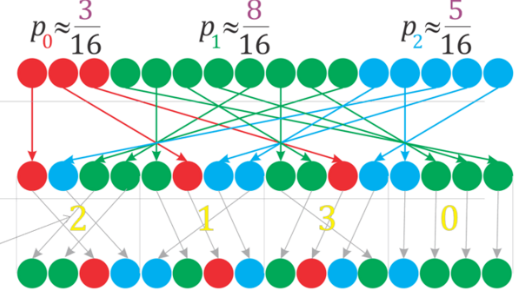

Նկ․ 3.2.1 Հաջորդականության գրաֆիկորեն ներկայացում

## 3.3 Պատահական մեծության էնտրոպիա

Ենթադրենք $`\xi`$ պատահական մեծությունն ընդունում է
$`\xi_{0},\ \ \xi_{1},\ ․․․,\ \ \xi_{N - 1}\`$արժեքները համապատասխանաբար
$`p_{0},\ \ p_{1},\ ․․․,\ \ p_{N - 1}`$
$`(\sum_{j = 0}^{N - 1}{p_{j} = 1}\ )`$ հավանականություններով։

$`\xi`$ պատահական մեծության երկուական էնտրոպիա է կոչվում հետևյալ
մեծությունը․

``` math
H\ (\xi) = - \sum_{k = 0}^{N - 1}{p_{k}{\ \log_{2}\ p}_{k}}\ \ \ \ \ \ \ (3.3.1)
```

Էնտրոպիան արտահայտում է իրավիճակի անորոշության չափը։ Կարելի է ասել նաև,
որ էնտրոպիան պատահական մեծության ցրվածության չափն է և այդ իմաստով այն
հիշեցնում է պատահական մեծության դիսպերսիա։ Սակայն ի տարբերություն
դիսպերսիայի, էնտրոպիան կախված չէ պատահական մեծության բաշխման տեսակից։
Թվարկենք էնտրոպիայի հիմնական հատկությունները.

1\) Էնտրոպիան ոչ բացասական մեծություն է։

2\) Էնտրոպիան սահմանափակ մեծություն է։

3\) Էնտրոպիան հավասար է 0-ի միայն այն դեպքում, երբ պատահական մեծությունն
ընդունում է արժեքներից մեկը $`p_{k} = 1`$ հավանականությամբ։

4\) Էնտրոպիան ընդունում է իր մեծագույն արժեքը, երբ պատահական մեծության
բոլոր ելքերը հավասարահնարավոր են։

5\) Անկախ պատահական մեծությունների արտադրյալի էնտրոպիան հավասար է նրանց
էնտրոպիաների գունարին։

Նշենք, որ էնտրոպիայի վերը բերված սահմանման մեջ 3.3.1 բանաձևը կիրառելի է
նաև այն դեպքում, երբ $`\xi`$ պատահական մեծությունը կարող է ընդունել
անվերջ բազմությամբ արժեքներ $`(N \rightarrow \infty)`$, եթե շարքը
զուգամետ է։

Երկուական կոդավորման դեպքում հաղորդագրության մեկ սիմվոլին հիշողության
հատկացվող բիթերի քանակը կարող է կամայականորեն մոտ լինել տեղեկատվության
աղբյուրի էնտրոպիային, բայց ոչ պակաս դրանից։ Էնտրոպիայի արժեքին հավասար
բիթերի քանակը հիմնականում հասանելի է այն դեպքերում, երբ տեղեկատվության
աղբյուրը կարող է գտնվել անվերջ բազմությամբ վիճակներում և եթե շարքը
զուգամետ է։

## 3.4 Հոֆֆմանի կոդավորումը WAV ֆայլերի համար

Հոֆֆմանի կոդավորումը տվյալների սեղմման ամենահայտնի և լայնորեն
օգտագործվող ալգորիթմներից մեկն է, որը առաջարկվել է Դեյվիդ Հոֆֆմանի
կողմից 1950-ականներին: Տվյալների սեղմման համար Հոֆֆմանի կոդավորումը
օգտագործում է կոդային աղյուսակներ՝ փոփոխական երկարության կոդերով, որոնք
կախված են տեղեկատվական տարրերի առաջացման հաճախականությունից: Հոֆֆմանի
կոդավորումը ապահովում է ստացված կոդային հաջորդականության
օպտիմալությունը: Հոֆֆմանի սեղմումը ներառված է փոփոխական կոդային բառի
երկարության ալգորիթմում: Այս ալգորիթմում անհատական ​​սիմվոլները
փոխարինվում են բիթային հաջորդականություններով, որոնք ունեն տարբեր
երկարություն: Ֆայլում բավականին հաճախ հանդիպող սիմվոլները կներկայացվեն
կարճ հաջորդականությունով, մինչդեռ հազվադեպ օգտագործվող սիմվոլները
կունենան ավելի երկար բիթերի հաջորդականություն: Հոֆֆմանի մեթոդը գործում է
բիթերը (0 և 1 բիթերի համադրություն) կոդավորելով, իրական տվյալները
ներկայացնելու համար: Նախ սահմանենք որոշ գաղափարներ \[8\]:

Սահմանում․Ենթադրենք ունենք վերջավոր քանակությամբ սիմվոլներից բաղկացած
$`\Psi = \{ a_{1},\ a_{2},\ ...\ ,\ a_{r}\}`$ այբուբենը։ $`\Psi`$
այբուբենի սիմվոլներից կազմված $`A = \ a_{i}\ a_{i2}\ \ldots\ a_{in}`$
վերջավոր հաջորդականությունը անվանենք $`n`$ երկարությամբ բառ $`\Psi`$
այբուբենում։ $`A`$ բառի երկարությունը նշանակենք $`\lambda(A)`$:

Ենթադրենք տրված է
$`\Omega = \{\beta_{1},\ \beta_{2},\ ...\ ,\ \beta_{n}\}`$ այբուբենը և
$`B`$-ն $`\Omega`$ այբուբենի բառ է: Նշանակենք $`\Sigma(\Omega)`$-ով
$`\Omega`$ այբուբենում բոլոր ոչ դատարկ բառերի բազմությունը։ Ենթադրենք
$`F`$-ը արտապատկերում է, որը $`\Sigma(\Psi)`$ բազմության յուրաքանչյուր
$`A`$ բառի համապատասխանության մեջ է դնում լիովին որոշակի
$`B = F(A),\ B \in \ \Sigma(\Omega)`$ բառ: $`B`$ բառը անվանենք $`A`$
բառի կոդ, իսկ $`A`$ բառից իր կոդին անցումը անվանենք կոդավորում։

Դիատրկենք $`\Psi`$ այբուբենի տառերի և $`\Omega`$ այբուբենի բառերի միջև
$`a_{j} \rightarrow \ B_{j}\ ,\ j = 1,2,\ \ldots,\ r`$
համապատասխանությունը։ Այս համապատասխանությունը անվանենք սխեմա և
նշանակենք $`\sigma`$ ։ Այն սահմանում է կոդավորում հետևյալ օրենքով՝
յուրաքանչյուր $`A = \ a_{i}\ a_{i2}\ \ldots\ a_{in}`$ բառին
$`\Sigma(\Omega)`$-ից համապատասխանեցվում է
$`B = \ B_{i}\ B_{i2}\ \ldots\ B_{in}`$ բառը:
$`B_{1},\ B_{2},\ \ldots\ B_{r}`$ բառերը անվանենք տարրական կոդեր:
Կոդավորման դիտարկված տեսակը անվանենք այբբենական կոդավորում։

Սահմանում․Եթե $`B`$ բառն ունի 3.4.1-ի տեսքը, ապա $`B^{\mathbf{՛}}`$ բառը
կանվանենք $`B`$ բառի սկզիբ, իսկ $`B^{\mathbf{"}}`$ բառը՝ $`B`$ բառի վերջ
կամ վերջնամաս:

$`B = {B^{\mathbf{՛}}\ B}^{\mathbf{"}}`$ (3.4.1)

Սահմանում․ Կասենք որ $`\sigma`$ սխեման ունի (պրեֆիկսի) սկզբնական
հատկություն, եթե ցանկացած $`i\`$և
$`j\ \ (1 \leq i\ ,\ \ j \leq r\ ,\ \ \ i \neq j)`$ բնական թվերի
համար$`B_{i}`$ բառը չի հանդիսանում $`B_{j}`$ բառի սկիզբ:

Թեորեմ․ Եթե սխեման ունի սկզբնական հատկություն, ապա այբբենական
կոդավորումը փոխմիարժեք է։

Ենթադրենք տրված են
$`\Psi = \left\{ a_{1},\ a_{2},\ ...\ ,\ a_{r} \right\},\ r > 1`$
այբուբենը և $`a_{1},\ a_{2},\ ...\ ,\ a_{r}`$ սիմվոլների հանդես գալու
հավանականությունները՝
$`p_{1},\ p_{2},\ ...\ ,\ p_{r}\ ,\ \ (\sum_{m = 1}^{r}{p_{m})}`$:
Ենթադրենք նաև, որ տրված է
$`\Omega = \left\{ \beta_{1},\ \beta_{2},\ ...\ ,\ \beta_{q} \right\}\ (q > 1)`$
այբուբենը, ապա կարող ենք կառուցել այբբենական $`\sigma`$ կոդավորման մի
շարք սխեմաներ, որոնք օժտված են փոխմիարժեքության հատկությամբ։

$`a_{j} \rightarrow \ B_{j}\ ,\ j = 1,2,\ \ldots,\ r`$ (3.4.2)

Յուրաքանչյուր սխեմայի համար սահմանենք $`l_{միջ}`$ միջին երկարությունը,
որպես տարրական կոդի մաթեմատիկական սպասում\`

``` math
l_{միջ} = \sum_{i = 1}^{r}{p_{i}l_{i}}\ \ \ \ (3.4.3)
```

Որտեղ $`l_{i} = l(B_{i})`$-ն $`B_{i}`$ բառի երկարությունն է: $`l_{միջ}`$
միջին երկարությունը ցույց է տալիս, թե քանի անգամ է մեծանում բառի
երկարությունը $`\sigma`$ կոդավարման ժամանակ։ Կարելի է ցույց տալ, որ
$`l_{միջ}`$-ը ընդունում է իր փոքրագույն $`l_{*}`$ արժեքը որոշակի
$`\sigma`$ սխեմայի դեպքում և այն որոշվում է հետևյալ բանաձևով․

$`l_{*} = \min{l_{միջ}(\sigma)}`$ (3.4.4)

Սահմանում․ $`\sigma`$ սխեմայով որոշված $`l_{միջ} = \ l_{*}`$ հատկությամբ
օժտված կոդերը կոչվում են փոքրագույն ավելցուկով կոդեր կամ Հոֆֆմանի կոդեր։
Փոքրագույն ավելցուկով կոդերով կոդավորման դեպքում բառի երկարության միջին
աճը կլինի փոքրագույնը։ Մեր դեպքում մուտքային տվյալները կազմված են
$`\Psi = \{ a_{1},\ a_{2},\ ...\ ,\ a_{r}\}`$ այբուբենից (մուտքային
այբուբեն), իսկ $`\Omega = \{ 0,1\}`$: $`\sigma`$ սխեմայի կառուցումը
կարելի է իրականացնել հետևյալ ձևով.

1\) Կարգավորում (վերադասավորում) ենք մուտքային այբուբենի սիմվոլները
(տառերը) իրենց հավանականությունների նվազման կարգով․
$`a_{i1}\ a_{i2}\ \ldots\ a_{ir}`$ և $`p_{i1}\ p_{i2}\ \ldots\ p_{ir}`$

2\) Փոքրագույն $`p_{i(r - 1)}`$ և $`p_{ir}`$հավանականություններով
$`a_{i(r - 1)}`$ և $`a_{ir}`$ սիմվոլները միավորում ենք մեկ նոր սիմվոլի
մեջ $`p_{i(r - 1)} + p_{ir}`$ հավանականությամբ։ Ավելացնում ենք 0
$`B_{i(r - 1)}`$ բառի սկզբում ($`{0B}_{i(r - 1)}`$) և 1 $`B_{ir}`$բառի
սկզբում $`{(1B}_{ir})`$:

3\) $`\Psi = \{ a_{1},\ a_{2},\ ...\ ,\ a_{r}\}`$ այբուբենում
$`a_{i(r - 1)}`$ և $`a_{ir}`$ սիմվոլները փոխարինում ենք նոր
$`a = \{ a_{i(r - 1)},\ \ a_{ir}\}`$ սիմվոլով, այսպիսով ստանալով նոր
այբուբեն: Կրկնում ենք 2 քայլը նոր այբուբենի նկատմամբ, և այսպես շարունակ
մինչև կմնա մեկ նոր սիմվոլ։

Հոֆֆմանի կոդավորման աշխատանքը բաղկացած է չորս փուլից.

1\) Մուտքային տվյալների հոսքի ընթերցում, բոլոր տեղեկատվական տարրերի և
յուրաքանչյուր տարրի առաջացման քանակի արդյունահանում:

2\) Հավաքված տվյալների հիման վրա օպտիմալ կոդային ծառի կառուցում:

3\) Կոդային աղյուսակի կազմում՝ ըստ նախապես կառուցված կոդային ծառի:

4\) Մուտքային տվյալների ուղղակի կոդավորում՝ հիմնվելով կազմված կոդային
աղյուսակի վրա:

Կառուցված ծառից կարելի է որոշել տարրի կոդային հաջորդականությունը՝
հետևելով արմատային հանգույցից մինչև այս տարրին համապատասխանող վերջնական
տերևը ուղուն:

Հոֆֆմանի ալգորիթմի հոսքը սկսվում է տվյալների յուրաքանչյուր մասից որոշակի
կոդ հատկացնելով՝ բազմակի սիմվոլներ ստանալու համար: Այնուհետև հաջորդ
քայլը առաջին սիմվոլի գրառումն է: Այս սիմվոլը ավելացվում է հաջորդ սիմվոլի
կոդին: Այն կստուգի, թե արդյոք դեռ կա վերջին սիմվոլը: Եթե վերջին սիմվոլը
գոյություն չունի, ապա սկսվում է կրկնության գործընթացը՝ հաջորդ սիմվոլին
ավելի շատ կոդ ավելացնելով: Վերջին սիմվոլի ստուգումըկրկին կատարվում է:
Եթե այս վերջին սիմվոլը գոյություն չունի, ապա գործընթացը կանգ է առնում:
Հոֆֆմանի մեթոդի աշխատանքի ձևը կայանում է նրանում, որ կոդավորվում է բիթը
(0 և 1 բիթերի համադրություն)՝ իրական տվյալները ներկայացնելու համար։
Հոֆֆմանի մեթոդով սեղմման քայլերը հետևյալն են.

1\) Հաշվարկել ֆայլում յուրաքանչյուր նիշի հայտնվելու հաճախականությունը
կամ կշիռը։ Նկ. 3.4.1-ում ներկայացված է wave ֆայլ, որտեղ առաջին 60
բայթերը ցուցադրվում են տասնվեցական ֆորմատով։

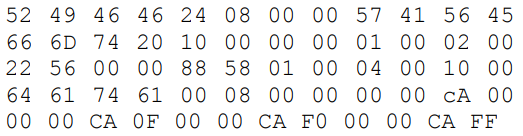

Նկ․ 3.4.1 Wave ֆայլի օրինակ

Հոֆֆմանի հաճախականության աղյուսակ կազմելու համար վերցվում է 16 բայթանոց
տվյալների ալիքի ֆայլ՝ սկսած 45-րդ բայթանոց օֆսեթից, որը արդեն տվյալներն
են՝

00 00 CA 00 00 00 CA 0F 00 00 CA F0 00 00 CA FF (3.4.5)

Ստացված հաճախականության բաշխման աղյուսակը ներկայացված է Աղյուսակ
3.4.1-ում \[7\]։

**Աղյուսակ 3․4․1**

|      Սիմվոլ      | 00  | CA  | 0F  | F0  | FF  |
|:----------------:|:---:|:---:|:---:|:---:|:---:|
| Հաճախականություն |  9  |  4  |  1  |  1  |  1  |

Դրանից հետո, յուրաքանչյուր նիշի համար ձևավորվում է ծառի հանգույց՝
համապատասխան հաճախականության արժեքների հետ միասին, ինչպես ներկայացված է
Նկ․ 3.4.2-ում:


Նկ․ 3.4.2 Աղյուսակ 3.4.1-ի հանգույցների ծառ

2\) Վերցնել երկու նիշ, որոնք ունեն ամենափոքր հաճախականությունը։

Նկ. 3.4.2-ում պատկերված հանգույցի հիման վրա ստացվում է, որ FO և FF
նիշերը ամենափոքր հանգույցներն են։

3\) Հոֆֆմանի ծառի ձևը՝ վերցված երկու տվյալներից։ Երկու նիշերի գումարը
սահմանվում է որպես ժամանակավոր արմատ, իսկ երկու նիշերն էլ սահմանվում են
որպես տերևներ։

Երկու նիշերն էլ FO-ն և FF-ն են, որոնք միավորվում են՝ ձևավորելով նոր ծառ,
որի արմատային արժեքը F0-ի և FF-ի կշիռների արժեքների գումարն է։
Այնուհետև, երկու ծառի հանգույցները ջնջվում են և փոխարինվում նոր ծառով,
որը ստացվում է երկու հանգույցների միաձուլումից։ Այս փուլի արդյունքները
ներկայացված են Նկ․ 3.4.3-ում։


Նկ․ 3.4.3 FO-ի և FF-ի միաձուլմամբ հանգույցների ծառ

Դրանից հետո յուրաքանչյուր հանգույց կրկին տեսակավորվում է ամենամեծից
մինչև ամենափոքր արժեքը, ինչպես ցույց է տրված Նկ․ 3.4.4-ում։

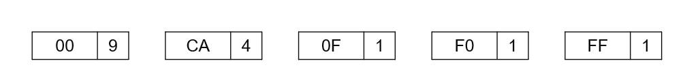

Նկ․ 3.4.4 Դասակարգված ծառ

Նկ․ 3.4.3-ը և Նկ․ 3.4.4-ը ստանալու գործընթացը կատարվում է շարունակաբար
մնացած բոլոր հանգույցների համար, մինչև որ ստացվի Հոֆֆմանի ծառը, ինչպես
Նկ․ 3.4.5-ում։

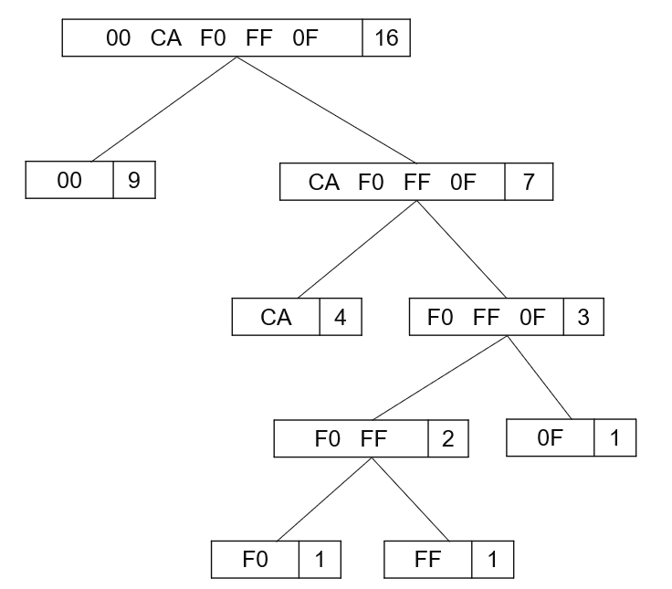

Նկ․ 3.4.5 Հոֆֆմանի ծառ

4\) Փոխել Հոֆֆմանի կոդի կառուցվածքը երկուական ծառի տեսքով։

Նկ․ 3.4.5-ի Հոֆֆմանի ծառից կոդը կարդալու համար սկսենք արմատից և ծառի ձախ
կողմում ամեն անգամ ավելացնենք 0, իսկ աջ կողմում՝ 1։ Արդյունքները
կստացվեն այնպես, ինչպես ցույց է տրված Նկ․ 3.4.6-ում։

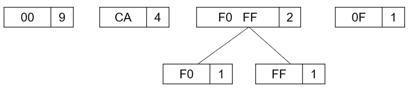

Նկ․ 3.4.6 Հոֆֆմանի ծառի վրա բիթային կոդ

5\) Յուրաքանչյուր նիշի համար որպես հղում օգտագործվող բիթային նախշը
դասավորված է բիթերով սկսած արմատներից մինչև տերևներ։

**Աղյուսակ 3․4․2**

| Սիմվոլ | Բիթային կոդ |
|:------:|:-----------:|
|   00   |      0      |
|   CA   |     10      |
|   0F   |     111     |
|   F0   |    1100     |
|   FF   |    1101     |

Օրինակ ներկայացված Wave տվյալների ֆայլը կոդավորելու համար Հոֆֆմանի ծառի
միջոցը կիրառելով կստանանք հետևյալ արդյունքները

00 00 CA 00 00 00 CA 0F 00 00 CA F0 00 00 CA FF (3.4.6)

Բիթային կոդերի աղյուսակին նայելով՝ արդյունքը կլինի՝

0 0 10 0 0 0 10 111 0 0 10 1100 0 0 10 1101 (3.4.7)

Սեղմման հարաբերակցության որոշումը կատարվում է՝ համեմատելով տվյալների
բիթերի քանակը սեղմելուց առաջ, այսինքն՝ բայթերով նիշերի քանակը՝ x 8 բիթ =
16 x 8 բիթ = 128 բիթ։ Մինչդեռ սեղմման արդյունքում ստացված բիթերի քանակը
28 բիթ է, ստացված սեղմման հարաբերակցությունը կազմում է.

$`\frac{28}{128}\  \times 100\ \% = 21,875\ \%`$ (3.4.8)

ԳԼՈՒԽ 4*\*
WAV ֆայլում թվային ձայնային ազդանշանի տվյալների սեղմման ալգորիթմի մշակում
=========================================================================

## 4.1 Wav ֆայլի տվյալների վերլուծիչ

WAV-ը (Waveform Audio file) թվային ձայնային տվյալների մշակման, փոխանցման
և պահպանման մասնագիտացված ձևաչափ է: WAV-ը ամենատարածված և լայնորեն
օգտագործվող ձայնային տվյալների ձևաչափերից մեկն է: WAV ձևաչափում ցանկացած
ձայնային տեղեկատվություն պահվում է իր սկզբնական տեսքով՝ առանց կորստի և
սեղմման, ի տարբերություն շատ այլ ձայնային տվյալների ձևաչափերի, որոնք
օգտագործում են կորստային սեղմման ալգորիթմներ (օրինակ՝ MP3, AAC, OGG
Vorbis և այլն): Wave ֆայլերը թույլ են տալիս ձայնագրել տարբեր ձայնային
տվյալներ տարբեր որակներով, ինչպիսիք են 8-բիթային կամ 16-բիթային
նմուշները՝ 11025 Հց, 22050 Հց կամ 44100 Հց հաճախականությամբ։ Բիթռեյթը
յուրաքանչյուր նմուշի բիթային չափն է, որը կազմում է 8 բիթ, 16 բիթ, 24 բիթ
կամ 32 բիթ \[3\]: 8-բիթային ալիքներում բոլոր նմուշները կզբաղեցնեն միայն
1 բայթ: Մինչդեռ 16-բիթայինների համար այն կզբաղեցնի 2 բայթ:

WAV ձևաչափը մշակվել է 1991 թվականին երկու խոշորագույն ամերիկյան
ընկերությունների՝ IBM-ի և Microsoft-ի կողմից, այդ իսկ պատճառով այն
օգտագործվում է Windows օպերացիոն համակարգի վրա հիմնված հարթակներում և,
հետաքրքիր է, որ այն CD-ներ ձայնագրելու ստանդարտ ձևաչափն է: Գրեթե
ցանկացած ժամանակակից ծրագիր, որը նախատեսված է տարբեր ձայնային տվյալների
ֆայլերի հետ աշխատելու համար, նույնպես աշխատում է WAV ֆայլերի հետ \[7\]:

WAV-ը հիմնված է այսպես կոչված իմպուլսային կոդային մոդուլյացիայի կամ
PCM-ի վրա: Այդ պատճառով WAV ֆայլի տվյալների տարածքը պարունակում է թվային
արժեքների հաջորդական հավաքածու: Յուրաքանչյուր արժեք հավասար է անալոգային
ազդանշանի մակարդակին, որը թվայնացվել է որոշակի ժամանակահատվածում: Հաշվի
առնելով այս առանձնահատկությունը և այն փաստը, որ WAV ֆայլը ձայնագրելիս
տվյալները չեն ենթարկվում սեղմման գործընթացների, ելքում ստացվում է բարձր
ձայնի որակ (թվայնացման ընթացքում կորուստներն ու աղավաղումները աննշան են
և գերազանցում են մարդու լսողության զգայունությունը) և մեծ քանակությամբ
ֆայլեր, որոնք ձայնագրվում են WAV ձևաչափով: Հիմնականում, WAV-ը
օգտագործվում է անալոգային ազդանշանը սկզբում թվայնացնելու, ապա այն այլ
ձայնային տվյալների ձևաչափերի փոխակերպելու համար: Որպես կանոն,
փոխակերպումը կատարվում է բարձր սեղմման հարաբերակցություն ունեցող
ձևաչափերի, բայց որոշ օգտակար տեղեկատվության կորստով այսինքն՝ ձայնի որակը
նվազում է: Հետևաբար, եթե տվյալների ամբողջականությունն ու որակը մեզ համար
ոչ պակաս կարևոր են, քան զբաղեցված հիշողության տարածքը, ապա մենք կանգնած
ենք WAV ֆայլերը սեղմելու խնդրի առաջ, ինչը միաժամանակ կնվազեցնի զբաղեցված
տարածքը և կկանխի թվայնացված ազդանշանի կորուստը կամ աղավաղումը:

Այսպիսով ձայնը չափվում է վայրկյանում հազարավոր անգամներ, և արժեքները, ի
վերջո, պահվում են WAV ֆայլում: Սկսենք պարզապես այդ արժեքները հանելով և
շարունակելով աշխատել դրանց հետ: Նախորդ բաժնում WAV ձևաչափի
նկարագրությանը հղվելով այն ունի շատ պարզ կառուցվածք: WAV ֆայլից
տվյալները վերլուծելու համար օգտագործվել են հետևյալ քայլերը: Սկզբում
պարզապես կարդում ենք բայթերի առաջին խումբը, որոնք գրված են որպես «RIFF»
և «WAVE», այնպես որ, եթե դրանք չեն գրվում, ապա գիտենք, որ ինչ-որ բան այն
չէ: Դրանից հետո կոդը պարզապես անցնում է ֆայլի մնացած մասի վրայով՝
կարդալով յուրաքանչյուր բաժնի անունը և ավելացնելով դրա գտնվելու վայրը
աղյուսակում: Անվանը միշտ հաջորդում է բաժնի չափը, և կարող ենք հեշտությամբ
անցնել հաջորդ բաժնին: Այնուհետև ընդհանուր պատկերացում կազմենք, թե
իրականում ինչ տվյալներ է պարունակում ֆայլը: Այնուհետև այս ֆունկցիան պետք
է գործարկվի տրված մուտքային WAV ֆայլով: Ներկայացված երեք ֆունկցիաները
ավելացված են Հավելված 1-ում:

Ենթադրենք, ստացել ենք հետևյալը.

“RIFF” : 0\
“JUNK” : 12\
“fmt” : 48\
“bext” : 96\
“data” : 1072

Հիմնականում հետաքրքրված ենք «ձևաչափ»-ի (fmt) և «տվյալներ»-ի (data)
բաժիններով, ուստի օգտագործում ենք մեկ այլ ֆունկցիա, որն օգտվում է
ստացված որոնման աղյուսակից՝ պարզապես անցնելու «ձևաչափ»-ի հատվածին, որտեղ
կարող ենք կարդալ որոշ օգտակար մետատվյալներ, ինչպիսիք են՝ մոնո, թե ստերեո
ֆայլ է, վայրկյանում ձայնագրված նմուշների քանակը և յուրաքանչյուր նմուշում
բիթերի քանակը։ Այնուհետև, անցնելով «տվյալներ»-ի բաժին, պարզապես կարդում
ենք տվյալները։

Տվյալները կարող են լինել մի քանի տարբեր ձևաչափերով, ուստի վերջին քայլը
դրանք փոխակերպելն է լողացող (float) թվերի պարզ զանգվածի։ Դա անելու համար
մտնում ենք մեծ ցիկլ, որտեղ կարող ենք պարզապես շարունակել վերցնել
տվյալները, որքան էլ որ շատ բայթեր լինեն յուրաքանչյուր նմուշում, և
փոխակերպել դրանք լողացող թվերի՝ օգտագործելով BytesToFloat ֆունկցիան։
Այնուհետև արժեքը փոքրացվում է նորմալացման գործակցով, որը պարզապես
բայթերի քանակի առավելագույն արժեքն է, որը կարող է պարունակել՝ այն
բերելով -1-ից մինչև դրական 1 միջակայք։ Եվ այս ամենը անելով նմուշները և
նմուշառման հաճախականությունը կվերադարձվեն որպես արդյունք։

BytesToFloat ֆունկցիայում օգտագործվել է ֆայլերի վերլուծման տեխնիկաներից
մեկը, որն է պարզապես չաշխատել առկա ձևաչափերի առնվազն կեսի հետ։ 24 բիթ
ձևաչափի համար անհրաժեշտ էր որոշակի բիթային փոփոխություն՝ բացասական
արժեքները ճիշտ մշակելու համար։

Եթե փորձենք ամփոփել Հավելված 1-ում ներկայացված ֆունկցիաները քայլերի
հերթականությամբ ապա կստանանք հետևյալը․

1\) Գտնել «ձևաչափ»-ի (fmt) և «տվյալներ»-ի (data) բաժինները․

\- Ստանալ բաժինների տեղաշարժերը որոնման աղյուսակից (lookup table):

2\) Վերլուծել fmt բաժինը offset + 8-ում

\- Բայթեր 0-1: formatCode (1=PCM, 3=IEEE float, 0xFFFE=Extensible)

\- Բայթեր 2-3: numChannels (1=mono, 2=stereo)

\- Բայթեր 4-7: sampleRate (օրինակ՝ 44100 Hz)

\- Բայթեր 8-9: byteRate

\- Բայթեր 10-11: blockAlign

\- Բայթեր 12-13: bitsPerSample (8, 16, 24 կամ 32)

\- Եթե ընդարձակելի է՝ բաց թողնել ևս 8 բայթ, կարդալ նոր formatCode-ը

3\) Տողում տվյալների բայթերի արդյունահանում

\- Փնտրել տվյալների կտորը offset + 4-ում

\- Կարդալ numBytesData-ն (4 բայթ)

\- Բեռնել բոլոր տողի բայթերը բուֆերի մեջ

4\) Հում բայթերը փոխակերպել լողացող նմուշների

\- Նմուշի քանակը = numBytesData / (bytesPerSample x numChannels)

\- Յուրաքանչյուր նմուշի համար (հարթեցվում է մոնոյի՝ առաջին ալիքը
վերցնելով).

\* Կարդալ bytesPerSample բայթերը

\* Փոխակերպել նշանային ամբողջ թվի՝ հիմնվելով bytesPerSample-ի վրա

\* Նորմալացնել \[-1.0, 1.0\] միջակայքում.

\- PCM-ի համար՝ բաժանել (2^(bitsPerSample-1) - 1)-ի

\- IEEE լողացող թվի համար՝ արդեն նորմալացված

5\) Վերադարձնել ազդանշանը նմուշներով և նմուշավորման հաճախությունով։

Վերծանիչի առանձնահատկությունները ներկայացված են Աղյուսակ 4.1.1-ում։

<table>
<colgroup>
<col style="width: 39%" />
<col style="width: 60%" />
</colgroup>
<thead>
<tr>
<th style="text-align: center;">Բաժինների որոնման աղյուսակ<br />
(Chunk Lookup Table)</th>
<th style="text-align: left;">Արագ պատահական հղում ձևաչափի և տվյալների
բաժիններին առանց ամբողջ ֆայլը վերլուծելու</th>
</tr>
</thead>
<tbody>
<tr>
<td style="text-align: center;">Փոքր-Էնդիան կառավարում<br />
(Little-Endian Handling)</td>
<td style="text-align: center;">WAV ձևաչափը պահանջում է LE բայթերի կարգ։
Կոդը ձեռքով է փոխարկվում։</td>
</tr>
<tr>
<td style="text-align: center;">Մոնո հարթեցում<br />
(Mono Flattening)</td>
<td style="text-align: left;">Բազմալիք ֆայլերը միայն առաջին ալիքով
կարդալու համար</td>
</tr>
<tr>
<td style="text-align: center;">Նորմալացում<br />
(Normalization)</td>
<td style="text-align: left;">Ձայնային նմուշները նորմալացված են [-1.0,
1.0] միջակայքում որպեսզի օգտագործվի լողացող թվերի մշակում</td>
</tr>
<tr>
<td style="text-align: center;">Նմուշի սեղմում<br />
(Sample Clamping)</td>
<td style="text-align: left;">Գրելիս կանխում է ամբողջ թվերի գերլցումը.
սեղմիչ (արժեք, -1.0, 1.0)</td>
</tr>
<tr>
<td style="text-align: center;">Սխալների մշակում<br />
(Error Handling)</td>
<td style="text-align: left;">Ֆայլի կառուցվածքի ստուգում (RIFF/WAVE
վերնագրեր, պահանջվող կտորներ)</td>
</tr>
<tr>
<td style="text-align: center;">RIFF լրացում<br />
(RIFF Padding)</td>
<td style="text-align: left;">Աշխատում է տարօրինակ չափի բաժինների
լրացման հետ (պահանջվում է WAV սպեցիֆիկացիայի համաձայն)</td>
</tr>
</tbody>
</table>

**Աղյուսակ 4․1․1**

## 4.2 Թվաբանական կոդավորման ալգորիթմի մշակում

Դիտարկենք Հոֆֆմանի կոդավորման սահմանափակումները.

1\) Կոդը տալիս է օպտիմալ լուծում, եթե աղբյուրի սիմվոլներում բաշխման
հավանականությունը հայտնի է։

2\) Յուրաքանչյուր սիմվոլի կոդավորումը ամբողջ թվով բիթեր է։

3\) Եթե աղբյուրի վիճակագրությունը փոխվում է, ապա Հոֆֆմանի կոդավորումը

արդյունավետ չէ։

Քանի որ սիմվոլի հավանականությունը մեծ չափի է, մեկ բառով կամ պարզ
պահպանումը բարդ է։ Թվաբանական կոդավորումն ունի կարևոր պատմություն, քանի
որ ալգորիթմը հաջողությամբ փոխարինել է Հոֆֆմանի կոդավորումը 25 տարի
շարունակ։ Թվաբանական կոդավորումը անկորուստ սեղմման տեխնիկա է, որը
նվազեցնում է WAV ֆայլերի չափսերը՝ մուտքային սիմվոլները կոդավորելով 0-ից
1 լողացող կետով թվի մեջ, մասնագիտացված իրականացումներով հասնելով մոտ 16%
սեղմման: Այս մեթոդը հաճախ համակցվում է կանխատեսման տեխնիկաների հետ՝
PCM-կոդավորված տվյալները մշակելու համար, որտեղ սեղմման բնորոշ
գործընթացները տևում են մոտավորապես 45 վայրկյան: Այն հաճախ օգտագործվում է
գծային կանխատեսման կոդավորումից (LPC) մնացած մնացորդները սեղմելու համար՝
չափը հետագայում նվազեցնելու համար առանց տվյալները կորցնելու։ Թվաբանական
կոդավորումը էնտրոպիայի կոդավորման մի մաս է, որը տվյալները վերածում է այլ
ձևի՝ ավելի հաճախ օգտագործելով մի փոքր և հազվադեպ ավելի շատ բիթով նիշեր։
Այս կոդավորման տեխնիկան մուտքային հաղորդագրությունը բաժանում է
սիմվոլների և յուրաքանչյուր սիմվոլը փոխարինում է լողացող կետով։
Թվաբանական կոդավորումն ամբողջ հաղորդագրությունը կոդավորում է կոտորակային
n թվի մեջ, որտեղ 0.0 = n \<1.0 :

Թվաբանական կոդավորման ալգորիթմը մուտքագրված սիմվոլների
հաջորդականությունը փոխարինում է լողացող կետով։ Քանի որ կոդավորված
հաղորդագրությունները ավելի երկար և բարդ են, այս պահանջի համար անհրաժեշտ
են որոշ բիթեր։ Սիմվոլների հաջորդականությունը եզակի թվի մեջ (0.1)
միջակայքով և (0.1) նշումով նշանակում է, որ բոլոր իրական թվերը 0-ից մինչև
1, ներառյալ 0-ն, բայց բացառությամբ 1-ի, կարող են գրվել հետևյալ կերպ՝ 0 =
x \< 1։ Այս թիվը կարող է եզակիորեն վերծանվել, ուստի այն ստեղծում է
սիմվոլների հաջորդականություն, որոնք օգտագործվում են այդ թվերը
գեներացնելու համար։ Թվաբանական կոդավորման արդյունքը 1 թվից փոքր և 0-ից
մեծ կամ հավասար թիվ է \[8\]։

Որպես այս աղյուսակի նշում, յուրաքանչյուր նիշ ունի նշված միջակայք,
բացառությամբ այն թվի, որն ունի բարձր հաճախականություն: Այսպիսով, «3e»
նշանի միջակայքը 0.8-ից մինչև 0.9999 է: Այնուհետև, կոդավորումը բացատրվում
է համաձայն հետևյալի կամ ըստ Նկ.4.2.1-ի․

1\) Set low = 0.0 (սկզբնական պայման)

2\) Set high = 1.0 (սկզբնական պայման)

3\) While (Մուտքագրվող սիմվոլը դեռ կա) do

4\) Վերցնել մուտքագրվող սիմվոլը

5\) CR(CodeRange) = high – low

6\) High = low + CR\*high_range(սիմվոլ)

7\) Low = low + CR\*low_range(սիմվոլ)

8\) Վերջացնել while-ը

9\) Տպել low-ը

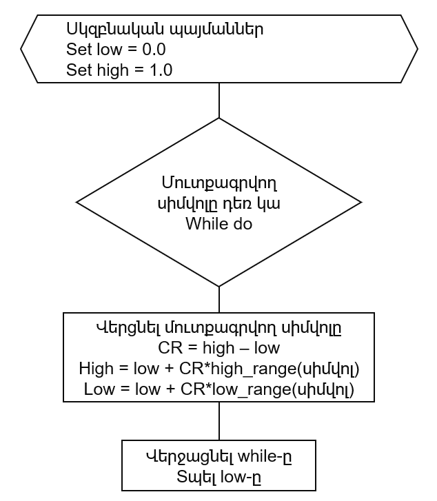

Նկ․ 4.2.1 Թվաբանական կոդավորման ալգորիթմը

Վերը նշված ալգորիթմը ներառում է ցածր, բարձր և CR վիճակի ստորին և վերին
սահմանը, ինչպես նաև յուրաքանչյուր սիմվոլի (նիշի) միջակայքային տիրույթը։
Սկզբում ցածր և բարձր արժեքները նախնականացվում են 0-ի և 1-ի միջոցով, ապա
երկուսի հաջորդ գործընթացը թարմացվում է 6 և 7 կետերի բանաձևերի միջոցով։

Ընդհանուր առմամբ, օգտվելով վերը նկարագրված ալգորիթմից, թվաբանական
կոդավորման միջոցով ձայնային ֆայլը սեղմելու քայլերը հետևյալն են՝

1\) Բացել ձայնային ֆայլը՝ վերնագիրը և ձայնային նմուշները կարդալու համար։

2\) Կարդալ ձայնային ֆայլը՝ տվյալները ստանալու համար։

3\) Վերցնել ձայնային նմուշի արժեքը 1-ից մինչև n։

4\) Դասավորեք ձայնային նմուշները ցուցակի շղթայում՝ օգտագործելով հատուկ
նիշերի ցուցակի բաժանիչ (#) տվյալների նմուշների միջև:

**Աղյուսակ 4․2․1**

| Համար | Արժեք | Հաճախականություն | Հավանականություն |
|:-----:|:-----:|:----------------:|:----------------:|
|   1   |  -1   |        5         |    5/15=0.33     |
|   2   |  10   |        1         |    1/15=0.06     |
|   3   |  07   |        3         |     3/15=0.2     |
|   4   |  3d   |        2         |    2/15=0.13     |
|   5   |   0   |        4         |    4/15=0.26     |

Յուրաքանչյուր նիշի հավանականությունը հայտնի լինելուց հետո, յուրաքանչյուր
սիմվոլի/նիշի կտրվի որոշակի միջակայք, որի արժեքները տատանվում են 0-ից
մինչև 1՝ կախված առկա հավանականություններից։ Այս դեպքում հատվածների համար
որևէ պայմանական հաջորդականություն չկա, կարևոր է, որ և՛ կոդավորիչը, և՛
վերծանիչը պետք է նույն կերպ աշխատեն։ Այնուհետև ստանանք Աղյուսակ
4.2.2-ում ներկայացված միջակայքերի աղյուսակը։

| Համար | Արժեք | Հաճախականություն | Հավանականություն |     Միջակայք      |
|:-----:|:-----:|:----------------:|:----------------:|:-----------------:|
|   1   |  -1   |        5         |    5/15=0.33     |  0 ≤ -1 \< 0.33   |
|   2   |  10   |        1         |    1/15=0.06     | 0.33 ≤ 10 \< 0.39 |
|   3   |  07   |        3         |     3/15=0.2     | 0.39 ≤ 07 \< 0.59 |
|   4   |  3d   |        2         |    2/15=0.13     | 0.59 ≤ 3d \< 0.72 |
|   5   |   0   |        4         |    4/15=0.26     | 0.72 ≤ 0 \< 0.98  |

**Աղյուսակ 4․2․2**

Աղյուսակի նկարագրությունը հետևյալն է.

1\) 0.0 = -1 \< 0.33: «-1» արժեքի միջակայքը 0.0-ից մինչև 0.33 է:

2\) 0.33 = 10 \< 0.39: «10» արժեքի միջակայքը 0.33-ից մինչև 0.39 է:

3\) 0.39 = 07 \< 0.5: «7» արժեքի միջակայքը 0.39-ից մինչև 0.59 է:

4\) 0.59= 3d \< 0.72: «3d» արժեքի միջակայքը 0.59-ից մինչև 0.72 է:

5\) 0.72 = 0 \< 0.98: «0» արժեքի միջակայքը 0.72-ից մինչև 0.98 է:

Տվյալների աղյուսակից ելնելով, կոդավորման արդյունքը կարող ենք տեսնել
Աղյուսակ 4.2.3-ում։

| Համար | Արժեք |     Low     |    High     |    CR     |
|:-----:|:-----:|:-----------:|:-----------:|:---------:|
| Սկիզբ |  \-   |      0      |      1      |     1     |
|   1   |  -1   |      0      |    0.33     |     1     |
|   2   |  10   |   0.1089    |   0.1287    |   0.33    |
|   3   |  07   |  0.116622   |  0.120582   |  0.0198   |
|   4   |  3d   |  0.1189584  |  0.1194732  |  0.00396  |
|   5   |   0   | 0.119329056 | 0.119462904 | 0.0005148 |

**Աղյուսակ 4․2․3**

Դիտարկենք մեկ այլ օրինակ։ Եթե ունենք 00 3e 1f 00 9a 00 1f 9a 00 3e 00 1f
00 3e 1f նմուշային ձայնային տվյալը, որը պետք է կոդավորվի, ապա այս
դեպքում ստացված հավանականությունների աղյուսակը կլինի ինչպես Աղյուսակ
4.2.4-ն է։ Նշենք նաև որ այս դեպքում հավանականությունների արժեքների
ճշտությունը վերցված է ավելի փոքր \[8\]։

**Աղյուսակ 4․2․4**

| Համար | Արժեք | Հաճախականություն | Հավանականություն |
|:-----:|:-----:|:----------------:|:----------------:|
|   1   |  00   |        6         |     6/15=0.4     |
|   2   |  1f   |        4         |     4/15=0.3     |
|   3   |  9a   |        2         |     2/15=0.1     |
|   4   |  3e   |        3         |     3/15=0.2     |

**Աղյուսակ 4․2․5**

| Համար | Արժեք | Հաճախականություն | Հավանականություն |    Միջակայք     |
|:-----:|:-----:|:----------------:|:----------------:|:---------------:|
|   1   |  00   |        6         |     6/15=0.4     |  0 ≤ 00 \< 0.4  |
|   2   |  1f   |        4         |     4/15=0.3     | 0.4 ≤ 1f \< 0.7 |
|   3   |  9a   |        2         |     2/15=0.1     | 0.7 ≤ 9a \< 0.8 |
|   4   |  3e   |        3         |     3/15=0.2     | 0.8 ≤ 3e \< 1.0 |

**Աղյուսակ 4․2․6**

| Համար | Արժեք |       Low        |      High       |        CR        |
|:-----:|:-----:|:----------------:|:---------------:|:----------------:|
| Սկիզբ |  \-   |        0         |        1        |        1         |
|   1   |  00   |        0         |        1        |        1         |
|   2   |  3e   |        0         |       0.4       |       0.4        |
|   3   |  1f   |       0.32       |       0.4       |       0.08       |
|   4   |  00   |      0.352       |      0.376      |      0.024       |
|   5   |  9a   |      0.352       |     0.3616      |      0.0096      |
|   6   |  00   |     0.35872      |     0.35968     |     0.00096      |
|   7   |  1f   |     0.35872      |    0.359104     |     0.000384     |
|   8   |  9a   |    0.3588736     |    0.3589888    |    0.0001152     |
|   9   |  00   |    0.35906944    |   0.35908096    |    0.00001152    |
|  10   |  3e   |    0.35906944    |   0.359074048   |   0.000004608    |
|  11   |  00   |   0.3590731264   |   0.359074048   |   0.0000009216   |
|  12   |  1f   |   0.3590731264   |  0.35907349504  |  0.000000036864  |
|  13   |  00   |  0.359073273856  | 0.395073384448  |  0.000000147456  |
|  14   |  3e   |  0.359073273856  | 0.3950733328384 | 0.0000000589824  |
|  15   |  1f   | 0.35907332104192 | 0.3950733328384 | 0.00000001179648 |

Աղյուսակ 4.2.6-ում ներկայացված տվյալների հիման վրա, վերջին տվյալների
ամենացածր արժեքը 0.35907332104192 է: Այս արժեքը օգտագործվում է 00 3e 1f
00 9a 00 1f 9a 00 3e 00 1f 00 3e 1f ձայնային տվյալները փոխարինելու
համար:

Այս սեղմման ռեժիմը ստատիկ թվաբանական կոդավորումն անկախ կիրառում է
ազդանշանային մատրիցի յուրաքանչյուր ալիքի վրա: Յուրաքանչյուր ալիքի համար
այն նախ արդյունահանում է նմուշի սյունը և կառուցում եզակի նմուշային
արժեքների տեսակավորված ցանկ, որը դառնում է այդ ալիքի սիմվոլների
բառարանը: Այնուհետև այն սկզբնական նմուշային հոսքը վերածում է ինդեքսային
հոսքի, որտեղ յուրաքանչյուր նմուշ փոխարինվում է այդ բառարանում իր սիմվոլի
դիրքով: Զուգահեռաբար, այն հաշվարկում է նույն ալիքի սիմվոլների
հաճախականությունները՝ ստեղծելով ֆիքսված հավանականության մոդել, որն
օգտագործվում է կոդավորման ընթացքում ամբողջ ալիքի համար:

Թվաբանական կոդավորիչը օգտագործում է ինդեքսի հոսքը և հաճախականության
աղյուսակը՝ թվային միջակայքը աստիճանաբար նեղացնելու համար, որը
ներկայացնում է ամբողջական հաղորդագրությունը: Հաճախակի սիմվոլները սպառում
են ավելի մեծ ենթամիջակայքեր և, հետևաբար, միջինում ավելի քիչ բիթեր են
արժենում, մինչդեռ հազվագյուտ սիմվոլները սպառում են ավելի փոքր
ենթամիջակայքեր և ավելի շատ բիթեր են արժենում: Յուրաքանչյուր սիմվոլի
համար մեկ կոդային բառ պահելու փոխարեն, մեթոդը արձակում է բիթեր, երբ
միջակայքը վերանորմալացվում է, ուստի վերջնական արդյունքը տվյալ ալիքի
համար կոմպակտ բիթային հոսք է: Գործընթացը կորուստներ չունի, քանի դեռ
դեկոդերը օգտագործում է ճիշտ նույն սիմվոլների դասավորությունը,
հաճախականության աղյուսակը և հաջորդականության երկարությունը:

Հոսքի տեսանկյունից, խողովակաշարը մոդելի կառուցում է, որին հաջորդում է
էնտրոպիայի կոդավորումը՝ ալիքի արդյունահանում, եզակի սիմվոլների աղյուսակի
ստեղծում, հաջորդականության ինդեքսավորում, հաճախականության հաշվարկ,
թվաբանական կոդավորում և անցած սեղմման ժամանակի կուտակում: Յուրաքանչյուր
ալիքի համար պահված ելքային տվյալներն են սիմվոլների աղյուսակը,
ինդեքսավորված հաջորդականության մետատվյալները, եթե անհրաժեշտ է ախտորոշման
համար, հաճախականության վեկտորը և սեղմված բիթային հոսքը: Այս դիզայնը պարզ
և դետերմինիստական ​​է, բայց սեղմման արդյունավետությունը կախված է նրանից,
թե որքանով է շեղված յուրաքանչյուր ալիքի բաշխումը, և կատարման ժամանակը
մոտավորապես գծային է նմուշների քանակով՝ սիմվոլների որոնման և կոդավորիչի
վերանորմալացման լրացուցիչ ծախսերով:

Ալգորիթմի C++ կոդը ներկայացված է Հավելված 2-ում:

Ձայնային ֆայլերի հետսեղմում կատարելու համար վերծանման գործընթացը հետևյալ
կերպ կլինի․

1\) Վերցնել կոդավորված սիմվոլ (Encoded Symbol - ES)

2\) Կատարել հետևյալը

3\) Փնտրել ES-ն շրջապատող սիմվոլների տիրույթը

4\) Տպել սիմվոլը

5\) CR = բարձր_միջակայք - ցածր_միջակայք

6\) ES = ES - ցածր_միջակայք

7\) ES = ES / CR

8\) Մինչև սիմվոլը սպառվի։

Այս դեպքում դատարկ սիմվոլը կարող է նշվել հատուկ սիմվոլի միջոցով, որտեղ
այս հետազոտության մեջ օգտագործվում է \#-ը: Կոդավորված հաղորդագրությունը
կարող է վերծանվել ստորև նշվածի համաձայն։

Ենթադրենք ES = 0,119329056։

**Աղյուսակ 4․2․4**

| Համար | Կոդավորված սիմվել | Արժեք | Low  | High |  CR  |
|:-----:|:-----------------:|:-----:|:----:|:----:|:----:|
|   1   |     0.3616032     |  -1   |  0   | 0.33 | 0.33 |
|   2   |      0.52672      |  10   | 0.33 | 0.39 | 0.06 |
|   3   |      0.6836       |  07   | 0.39 | 0.59 | 0.2  |
|   4   |       0.72        |  3d   | 0.59 | 0.72 | 0.13 |
|   5   |     0 (Վերջ)      |   0   |  \-  |  \-  |  \-  |

## 4.3 Թվաբանական կոդավորման և Zstd սեղմման համատեղում

Այժմ կատարենք հետազոտական աշխատանքի առաջին փուլը։ Դիտարկենք թվաբանական
կոդավորմամբ սեղմված ելքային տվյալների ներմուծումը Zstd ալգորիթմ։
Թվաբանական կոդավորման սեղմված արդյունքը Zstd ալգորիթմի մեջ ներմուծելը
ստեղծում է խողովակաշարային սեղմման ճարտարապետություն, որը հայտնի է նաև
որպես հիբրիդային կամ բազմաստիճան սեղմման սխեմա: Այս կարգավորման մեջ
յուրաքանչյուր փուլ թիրախավորում է տվյալների ավելորդության տարբեր
տեսակներ։ Թվաբանական կոդավորումը գործում է որպես էնտրոպիայի կոդավորիչ՝
կենտրոնանալով առանձին սիմվոլների վիճակագրական հաճախականության վրա։
Zstd-ն օգտագործում է LZ77-ի (բառարանային համապատասխանեցում) և FSE-ի
(վերջավոր վիճակի էնտրոպիա) համադրություն՝ ավելի մեծ օրինաչափություններ և
կրկնություններ գտնելու համար։ Այսինքն եթե թվաբանության կոդավորիչը արդեն
մոտ է էնտրոպիայի օպտիմալին, Zstd-ն սովորաբար քիչ կամ ընդհանրապես չի տա
լրացուցիչ շահույթ, իսկ երբեմն այն կմեծացնի շրջանակման կամ բառարանի
ծանրաբեռնվածության պատճառով \[8\]։ Առաջարկվող քայլերը.

1\) Սեղմել WAV տվյալները թվաբանական կոդավորիչով։

2\) Սեղմել այդ արդյունքը Zstd-ով։

3\) Պահպանել ճշգրիտ վերակառուցման համար անհրաժեշտ բոլոր մետատվյալները։։

Այժմ դիտարկենք, թե ինչ տեսակի ելքային տվյալներ են ստացվում թվաբանական
սեղմման ելքում և կարող են արդյոք դրանք օգտագործվել որպես մուտքային
տվյալներ Zstd-ում։ Թվաբանական սեղմումը ստեղծում է սեղմված բիթային հոսք,
որը, ըստ էության, երկուական թվերի (0-ներ և 1-ներ) հաջորդականություն է,
որը ներկայացնում է 0-ի և 1-ի միջև շատ մեծ կոտորակային թիվ։ Zstd-ը
նախատեսված է ցանկացած կամայական բայթային հոսք մշակելու համար, ներառյալ
արդեն սեղմված տվյալները։ Այսպիսով կունենանք հետևյալը.

Թվաբանական սեղմման ելք.

- Ստեղծում է երկուական բիթային հոսք, որը ներկայացված է որպես բայթային
  բուֆեր (բայթերի զանգված կամ բայթերի օբյեկտ):

- Ելքը սեղմված երկուական տվյալներ են՝ առանց կառուցվածքային
  ենթադրությունների:

Zstd-ի մուտք.

- Ընդունում է բայթերի ցանկացած հաջորդականություն որպես մուտքային
  տվյալներ:

Zstd-ին չի հետաքրքրում, թե ինչ են ներկայացնում բայթերը. այն դրանք
համարում է սեղմման համար նախատեսված տվյալներ: Մաթեմատիկորեն ներկայացված
է 4.3.1-ում։

$`C(x) = Z(A(x))`$ (4.3.1)

Վերծանումը կլինի հակառակ հերթականությամբ. Zstd-ի վերծանում, ապա
թվաբանական վերծանում, մաթեմատիկորեն ինչպես 4.3.2-ը․

$`D(y) = A^{- 1}(Z^{- 1}(y))`$ (4.3.2)

Այնպես որ դրանք լիովին համատեղելի են։ Այսպիսով, խողովակաշարը պարզ է.
Թվաբանական սեղմումը ստեղծում է բայթեր, Zstd-ն՝ կարդում և ստեղծում է
սեղմված բայթեր: Միջանկյալ ձևաչափի փոխակերպման կարիք չկա: Բայց այսպիսի
համատեղումը հիմնականում վատ է աշխատում, քանի որ թվաբանական կոդավորումն
արդեն իսկ հեռացնում է վիճակագրական ավելորդության մեծ մասը, ուստի Zstd-ին
շատ քիչ բան է մնում սեղմելու համար։ Թվաբանականի ելքը մոտ է էնտրոպիայի
օպտիմալին, ուստի Zstd-ն հաճախ չի կարող այն ավելի կրճատել։ Zstd-ն
ավելացնում է իր սեփական շրջանակի/վերնագրի մետատվյալները, ինչը կարող է
վերջնական չափը մի փոքր մեծացնել։ Երկու փուլերը ավելացնում են լրացուցիչ
CPU ժամանակ և՛ կոդավորման, և՛ վերծանման համար, ուստի արագությունը
վատանում է նույնիսկ այն դեպքում, երբ չափը չի բարելավվում։ Այսպիսով, այս
խողովակաշարը հաճախ ապահովում է ավելի բարձր ծախսեր (ժամանակ/բարդություն)՝
առանց նշանակալի չափի օգուտի։

Այժմ դիտարկենք նշված երեք սեղմման մեթոդների համեմատությունը օգտագործելով
պարզ WAV ֆայլ, որի սկզբնական չափը 176,444 բայթ է: Կազմված սեղմման
չափանիշների համեմատությունը ներկայացված է Աղյուսակ 4.3.1-ում:

|   Սեղմման մեթոդ   | Սեղմված ֆայլի չափ | Սեղմման հարաբերակցություն | Ժամանակ (մվ) |
|:-----------------:|:-----------------:|:-------------------------:|:------------:|
|       Zstd        |      172.927      |          1.0203           |    29.37     |
|    Թվաբանական     |      173.303      |          1.0181           |    49.45     |
| Թվաբանական + Zstd |      173.318      |          1.0180           |    120.05    |

**Աղյուսակ 4․3․1**

Zstd-ը սեղմումը թվաբանականից առաջ տեղադրելը կապահովի ավելի լավ սեղմման
հարաբերակցություն, քանի որ այս հերթականությունը համապատասխանում է
ժամանակակից սեղմման մեջ օգտագործվող ստանդարտ «Բառարան + Էնտրոպիա»
մոդելին։ Ահա, թե ինչպես կգործի այս խողովակաշարը.

1\) Առաջին փուլ. Zstd - Կատարվում է LZ77՝ մեծ կրկնվող տողերը գտնելու և
կարճ ցուցիչներով փոխարինելու համար։ Այն կատարում է տվյալների ծավալը
նվազեցնելու «ծանր աշխատանքը»։

2\) Երկրորդ փուլ. Թվաբանական - Վերցնում է մնացած լիտերալները և
համապատասխանեցման շեղումները և կատարում է էնտրոպիայի կոդավորում՝
սեղմելով մինչև դրանց տեսականորեն բիթային սահմանաչափ։ Մաթեմատիկորեն
ներկայացված է 4.3.3-ում։

$`C(x) = A(Z(x))`$ (4.3.3)

Վերծանումը կլինի հակառակ հերթականությամբ. ապա թվաբանական վերծանում,
Zstd-ի վերծանում, մաթեմատիկորեն ինչպես 4.3.4-ը․

$`D(y) = Z^{- 1}(A^{- 1}(y))`$ (4.3.4)

Zstd-ի և թվաբանականի համատեղումը ավելի լավ հարաբերակցություն է, քան
միայն թվաբանականը, քանի որ այն մշակում է և՛ մեծ օրինաչափությունները, և՛
փոքր վիճակագրությունները։ Այս դեպքում ևս տվյաների հոսքի խնդիր չի լինի և
հետևաբար, թվաբանական տրամաբանությունը Zstd-ով սեղմված ֆայլը կդիտարկի
որպես իր նոր տվյալների «աղբյուր» և կփորձի այն ավելի սեղմել: Այսպիսի
խողովակաշարը արդյունավետ է միայն հստակ կառուցվածքային տվյալների վրա։
Խողովակաշարային համատեղման C++ կոդը ներկայացված է Հավելված 3-ում:

**Աղյուսակ 4․3․2**

|   Սեղմման մեթոդ   | Սեղմված ֆայլի չափ | Սեղմման հարաբերակցություն | Ժամանակ (մվ) |
|:-----------------:|:-----------------:|:-------------------------:|:------------:|
|       Zstd        |      172.927      |          1.0203           |    29.37     |
|    Թվաբանական     |      173.303      |          1.0181           |    49.45     |
| Թվաբանական + Zstd |      173.318      |          1.0180           |    120.05    |
| Zstd + Թվաբանական |      173.110      |          1.0192           |    119.87    |

## 4.4 Zstd համադրումը այլ կոդավորումներին և դրանց համեմատությունը

Այս գլխում կներկայացվի նույն խողովակաշարային ալգորիթմը փոխարինելով
թվաբանական կոդավորումը Հոֆֆմանի կոդավորմամբ և համեմատություն երկու
մեթոդների արդյունքների միջև։

Zstd-ի համատեղումը Հոֆֆմանի կոդավորման հետ երկաստիճան, կորուստներից
զուրկ սեղմման խողովակաշար է, որտեղ մուտքային տվյալները նախ սեղմվում են
Zstd-ով, ապա ստացված Zstd բայթային հոսքը կրկին սեղմվում է արտաքին
Հոֆֆմանի կոդավորիչով։ Այս մեթոդի հետաքրքիր լինելու պատճառն այն է, որ այն
ստուգում է, թե արդյոք երկրորդ էնտրոպիայի կոդավորման անցումը կարող է
օգտագործել առաջին սեղմման ելքում մնացած վիճակագրական շեղումը։
Մաթեմատիկորեն ներկայացված է 4.4.1-ում։

$`C(x) = H(Z(x))`$ (4.4.1)

Հոֆֆմանի կոդավորման փուլում սեղմումը սկսվում է մուտքային բայթերը
սկանավորելով և 0-ից մինչև 255 բայթային արժեքների համար հաճախականության
մոդել կառուցելով։ Այդ հաճախականություններից կառուցվում է Հոֆֆմանի ծառ,
որպեսզի հաճախակի սիմվոլները ստանան ավելի կարճ կոդեր, իսկ հազվագյուտ
սիմվոլները՝ ավելի երկար կոդեր։ Այնուհետև կոդավորիչը գրում է կոմպակտ
հոսք, որը ներառում է ձևաչափի նշիչ, սկզբնական մուտքային չափը և կոդերի
գիրքը սահմանելու համար անհրաժեշտ հաճախականության աղյուսակը, որին
հաջորդում է էնտրոպիայի կոդավորված բիթային հոսքը։ Հայեցակարգային առումով,
Zstd-ն արդեն իսկ ժամանակակից կոմպրեսոր է, որը կատարում է ուժեղ
ավելորդության հեռացում և ներքին էնտրոպիայի կոդավորում, ուստի երկրորդ
Հոֆֆմանի փուլը հաճախ շատ քիչ օգտակար կառուցվածք ունի օգտագործելու համար։
Դրա պատճառով արտաքին Հոֆֆմանի քայլը կարող է հեշտությամբ ավելացնել իր
վերնագրից և մոդելի մետատվյալներից վերադիր ծախսեր, և այդ վերադիր ծախսը
կարող է գերազանցել ցանկացած փոքր մնացորդային շահույթ։ Ահա թե ինչու
Zstd-ի համատեղումը Հոֆֆմանի կոդավորման հետ հաճախ օգտակար է որպես
փորձարարական համեմատության խողովակաշար, բայց միշտ չէ, որ լավագույն
արտադրական ընտրությունն է արդեն լավ սեղմված կամ բարձր էնտրոպիա ունեցող
չափերի նվազեցման համար։ Հետսեղմումը կունենա հեևյալ հերթականությունը և
4.4.2-ի մաթեմատիկական ներկայացումը.

1\) Հոֆֆմանի ապակոդավորում,

2\) Zstd հետսեղմում:

$`D(y) = Z^{- 1}(H^{- 1}(y))`$ (4.4.2)

**Աղյուսակ 4․4․1**

<table style="width:99%;">
<colgroup>
<col style="width: 25%" />
<col style="width: 14%" />
<col style="width: 26%" />
<col style="width: 13%" />
<col style="width: 19%" />
</colgroup>
<thead>
<tr>
<th style="text-align: center;">Սեղմման մեթոդ</th>
<th style="text-align: center;">Սեղմված ֆայլի չափ</th>
<th style="text-align: center;">Սեղմման հարաբերակցություն</th>
<th style="text-align: center;">Սեղմման ժամանակ (մվ)</th>
<th style="text-align: center;">Հետսեղմման ժամանակ<br />
(մվ)</th>
</tr>
</thead>
<tbody>
<tr>
<td style="text-align: center;">Zstd + Թվաբանական</td>
<td style="text-align: center;">173.110</td>
<td style="text-align: center;">1.0192</td>
<td style="text-align: center;">72.33</td>
<td style="text-align: center;">88.09</td>
</tr>
<tr>
<td style="text-align: center;">Zstd + Հոֆֆման</td>
<td style="text-align: center;">174.987</td>
<td style="text-align: center;">1.0083</td>
<td style="text-align: center;">92.00</td>
<td style="text-align: center;">69.34</td>
</tr>
</tbody>
</table>

Վերջին աղյուսակում Zstd-ի և թվաբանականի համատեղումը ստեղծել է 173,880
բայթ սեղմված չափ՝ 1.0147x սեղմման հարաբերակցությամբ, մինչդեռ Zstd և
Հոֆֆմանի համատեղումը ստեղծել է 174,987 բայթ՝ 1.0083x սեղմման
հարաբերակցությամբ։ Սա նշանակում է, որ Zstd և Հոֆֆմանի համատեղումը 1,107
բայթով ավելի մեծ է և ունի 0.0064x-ով ավելի ցածր սեղմման
հարաբերակցություն նույն WAV մուտքի վրա։ Ընդհանուր առմամբ, աղյուսակում
սեղմման արդյունավետության հիման վրա, լավագույն մեթոդը Zstd և թվաբանական
կոդավորման համատեղումն է։

# Եզրակացություն

Մագիստրոսական ատենախոսության ընթացքում կատարվել է կոդավորման դասական
ալգորիթմների ուսումնասիրություն, ձայնային ազդանշանի թվայնացված
տեղեկատվության պահպանման ձևաչափերի և դրանց սեղմման ալգորիթմների։
Աշխատանքի ընթացքում իրականացվել է օպտիմալ սեղմման ալգորիթմի մշակում և
իրագործում ծրագրային ապարատի միջոցով։ Այն իրենից ներկայացնում է
խողովակաշարային ալգորիթմ, որն ապահովում է սեղմման որոշ չափանիշների
լավացում։ Նախագիծը բավարարում է առաջադրված տեխնիկական առաջադրանքի
պահանջներին։ Կատարվել են մի շարք հետազոտություններ և համետատություններ
աղյուսակային տեսքով՝ ալգորիթների միջև, ինչպես նաև սեղմման չափանիշների
կախվածությունները միմյանցից։

# Գրականության ցանկ

1.  D.Salomon, Data Compression. The Complete Reference Fourth Edition,
    Springer-Verlag London Limited, 2007. –P. 17-23, 719-850.

2.  What is Zstd.
    <https://www.ituonline.com/tech-definitions/what-is-zstd-zstandard/>

3.  M. Kucherawy, Zstandard Compression and the 'application/zstd' Media
    Type, Facebook, 2021.
    <https://datatracker.ietf.org/doc/html/rfc8878>

4.  Alan V. Oppenheim, Ronald W. Schafer and John R. Buck, Discrete-Time
    Signal Processing, Second Edition, Prentice-Hall, 1999. -pp 541-600.

5.  <https://github.com/facebook/zstd>

6.  <https://fastcompression.blogspot.com/2011/05/lz4-explained.html>

7.  <https://www.ijcttjournal.org/Volume64/IJCTT-V64P106.pdf>

8.  <https://ijssst.info/Vol-19/No-6/paper36.pdf>

